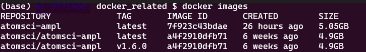
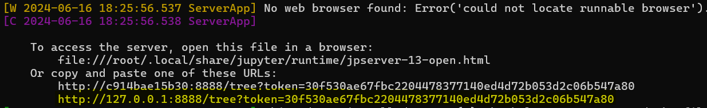
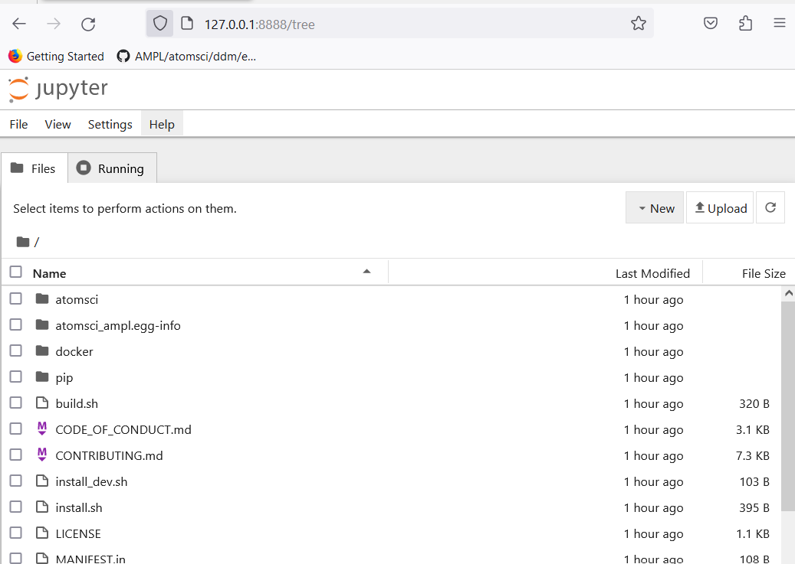
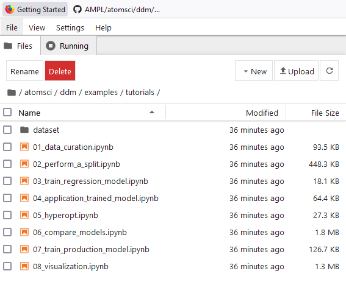
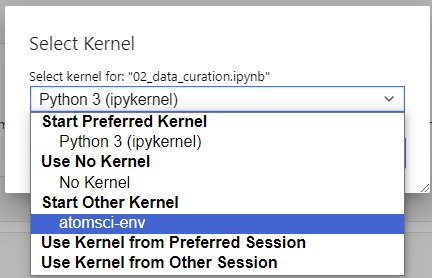

########################
Install AMPL With Docker
########################

This page provides an option to use Docker to install `AMPL <https://github.com/ATOMScience-org/AMPL>`_. For an alternate way, please see the "Getting Started" `Install <https://ampl.readthedocs.io/en/latest/get_started/install.html>`_ page.

To install `AMPL <https://github.com/ATOMScience-org/AMPL>`_ software using Docker, the major steps are:

* :ref:`Create Docker`
* :ref:`Start container`
* :ref:`Start Jupyter notebook`

.. _Create Docker:

Create or Pull a Docker Image
*****************************

System Requirements
===================

The Docker image will run on Linux / WSL / macOS (Intel only).

If you don't have Docker Desktop installed, please follow instructions `here <https://www.docker.com/get-started>`_.

Once it's installed, click on the Docker icon to start. Leave it running when using Docker.

You can either pull a prebuilt `AMPL <https://github.com/ATOMScience-org/AMPL>`_ image (option 1) or build one yourself (option 2).

Option 1: Pull a Prebuilt AMPL Image from Docker Repo
=====================================================

The simplest method is to download a prebuilt Docker image from DockerHub. For every official `AMPL <https://github.com/ATOMScience-org/AMPL>`_ release, a docker image will be pushed to its `Docker Hub <https://hub.docker.com/r/atomsci/atomsci-ampl>`_. 

To pull a prebuilt `AMPL <https://github.com/ATOMScience-org/AMPL>`_ image:

.. code-block::

   docker pull atomsci/atomsci-ampl:latest

After that, please follow the instruction from the ":ref:`Start container`" step.

Option 2: Build an Image Using **Dockerfile**
=============================================

There may be a few reasons why you want to build your own `AMPL <https://github.com/ATOMScience-org/AMPL>`_ Image using a Dockerfile.  These can include:

* You want to customize the install options for your environment,
* You want to test a development version/branch to try new features or bugfixes

First clone `AMPL <https://github.com/ATOMScience-org/AMPL>`_  github repo, then find the Dockerfile:

.. code-block::

   git clone https://github.com/ATOMScience-org/AMPL.git  
   ### The following line is _optional_. If you want to check out a development branch instead of the default branch (master).
   git checkout 1.6.1                    # (optional) checkout a dev branch, 1.6.1 for example
   cd AMPL/docker                        # To get to the Dockerfile

Build an image using the Dockerfile:

.. code-block::

   # example 1
   docker build -t atomsci-ampl .       # by default, "latest" will be the tag
   # - or - 
   # example 2
   docker build -t atomsci-ampl:<tag> . # specify a name for <tag>

This normally takes about 15-20 minutes to build. Once it's built on your machine, it can be reused.

.. note::

    *To build without cache, add "--no-cache" flag after "docker build". For example, "docker build --no-cache -t atomsci-ampl ."*

.. _Start container:

Run a Docker Container
**********************

To see what images are running on your machine, type "docker images". 

Use "docker run ... `<IMAGE>`" command to start the container. The command syntax is:

.. code-block::

   docker run -it -p <port>:<port> -v <local_folder>:<directory_in_docker> <IMAGE>

Use either following example to start the container:

.. code-block::

   # example 1 # if built locally
   docker run -it -p 8888:8888 -v ${PWD}:/home atomsci-ampl
   # - or -
   # example 2 # if pulled from atomsci's docker hub
   docker run -it -p 8888:8888 -v ${PWD}:/home atomsci/atomsci-ampl

To get more info for the "docker run" command options, type "docker run --help": 

.. code-block::

     -i, --interactive                    Keep STDIN open even if not attached
     -t, --tty                            Create a pseudo terminal
     -p, --publish port(s) list           Publish a container's port(s) to the host
     -v, --volume list                    Bind mount a volume

.. _Start Jupyter notebook:

Start the Notebook Server From a Container
*******************************************

To launch the server, you can choose to run using "jupyter-notebook" or "jupyter-lab" using the same port when starting the container. We use "jupyter-notebook" command as examples here:

.. code-block::

   jupyter-notebook --ip=0.0.0.0 --allow-root --port=8888 &

This will output a message with similar URLs to this:

Connect to the Jupyter Notebook UI From a Browser
=================================================

Copy and paste the URL from the output message (highlighted in yellow from above) to the browser on your computer. Like this one:

.. note::

    *If this doesn't work, exit the container and choose a different port
    such as "7777" or "8899" (in all 3 places it's 
    written), then rerun both commands in "Start a Docker container" and 
    "Start the Jupyter notebook from a container". 
    Be sure to save any work in your container. See instructions on how to "Save work from Docker Jupyter".*  

Once connected, you will see a screen like this:

Code Examples
=============

The `AMPL <https://github.com/ATOMScience-org/AMPL>`_ code is in:

.. code-block::

   http://127.0.0.1:<port_number>/tree/AMPL/atomsci/ddm/

The tutorials examples are in:

.. code-block::

   http://127.0.0.1:<port_number>/tree/AMPL/atomsci/ddm/examples/tutorials

.. note::

    *"<port_number>" is the number that you used when starting "docker run -p ...".*

Here's a screenshot of the `AMPL <https://github.com/ATOMScience-org/AMPL>`_ tutorials directory:

Use **atomsci-env** as the Run Kernel
=====================================

In order to use `AMPL <https://github.com/ATOMScience-org/AMPL>`_ Framework, select "atomsci-env" as the run kernel for the notebook. This should be set during image creation. In case it's not set, or if you want to verify. Try one of the following:

From an existing notebook, top menu bar "Kernel" > "Change Kernel" > "atomsci-env"

From a new notebook, click "File" > "New" > "Notebook" menu, and select **atomsci-env** as the run kernel

.. image:: ../_static/img/install_with_docker_files/docker-kernel-outside-nb.png

Save Work From Docker
=====================

A Docker container is stateless. Once you exit, the work will not persist. There are a couple of ways to save your files:

1) From the browser Jupyter Notebook page menu, "File" -> "Download" to download the file(s).

2) Use mount. When you start the Docker with "-v" option:

.. code-block::

   docker run -it -p <port>:<port> -v <local_folder>:<directory_in_docker> <IMAGE>

It binds the <local_folder> with <directory_in_docker> , meaning that the file(s) in <directory_in_docker>, will be available in <local_folder>.

For example:

Run the docker with "-v" to bind the directories

.. code-block::

   docker run -it -p 8888:8888 -v ~:/home atomsci-ampl # <local_folder> -> "~", <directory_in_docker> -> "/home".

Save, copy the file(s) to <directory_in_docker>

.. code-block::

   root@d8ae116b2a83:/AMPL# pwd
   /AMPL
   root@d8ae116b2a83:/AMPL# cp atomsci/ddm/examples/02_perform_a_split.ipynb /home

The file(s) will be in the <local_folder>.

Useful Docker Commands
======================

.. code-block::

   docker run --help                              # get help messages
   docker ps -a                                   # check docker processes
   docker images                                  # list local docker images
   docker rmi <image>                             # remove an image
   docker cp file.txt <container_id>:/file.txt    # copy from local to container
   docker cp <container_id>:source_path dest_path # copy from container to local

Troubleshooting
===============

Problem with token

If you try to connect the Jupyter Notebook URL, but got a prompt for password or token, go to the docker terminal, type in

.. code-block::

   jupyter server list

.. image:: ../_static/img/install_with_docker_files/jupyter_server_list.png

And copy the string after "token=" and  paste that, then click "Log in"

