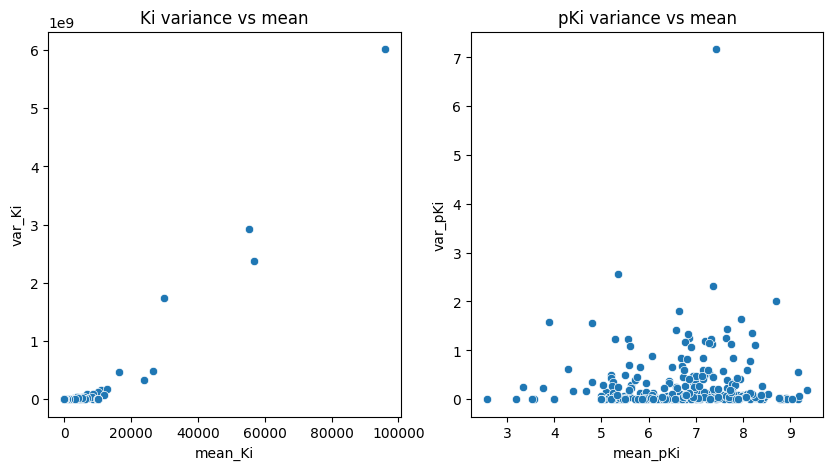
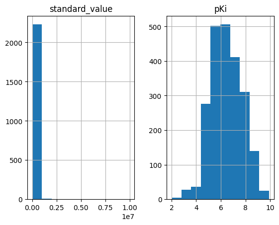

################
01 Data Curation
################

*Published: June, 2024, ATOM DDM Team*

------------

To train a machine learning model from data, that data must first be
"curated" to ensure that chemical structures and properties are
represented consistently. Curating raw data is a long, detailed process
that takes several steps.
`SMILES <https://en.wikipedia.org/wiki/Simplified_molecular-input_line-entry_system>`_
strings need to be standardized, measurements need to be converted to
common units, outliers need to be removed or corrected, and replicates
need to be combined. These steps are vital to create datasets that can
be used to train useful predictive models. Here we will cover some
functions in `AMPL <https://github.com/ATOMScience-org/AMPL>`_ that
will help you to perform these steps.

-  `base_smiles_from_smiles <https://ampl.readthedocs.io/en/latest/utils.html#utils.struct_utils.base_smiles_from_smiles>`_
-  `standardize_relations <https://ampl.readthedocs.io/en/latest/utils.html#utils.data_curation_functions.standardize_relations>`_
-  `compute_negative_log_responses <https://ampl.readthedocs.io/en/latest/utils.html#utils.data_curation_functions.compute_negative_log_responses>`_
-  `remove_outlier_replicates <https://ampl.readthedocs.io/en/latest/utils.html#utils.curate_data.remove_outlier_replicates>`_
-  `aggregate_assay_data <https://ampl.readthedocs.io/en/latest/utils.html#utils.curate_data.aggregate_assay_data>`_

These are just a few of the steps needed to curate a dataset.

Import Standard Data Science Packages
*************************************

To use `AMPL <https://github.com/ATOMScience-org/AMPL>`_, or to do
almost anything else with data, you'll need to become familiar with the
popular packages `pandas <https://pandas.pydata.org/>`_,
`numpy <https://numpy.org/>`_,
`matplotlib <https://matplotlib.org/>`_ and
`seaborn <https://seaborn.pydata.org/>`_. When you installed
`AMPL <https://github.com/ATOMScience-org/AMPL>`_ you will have
installed these packages as well, so you simply need to import them
here.

.. code:: ipython3

    import os
    import pandas as pd
    import numpy as np
    import matplotlib.pyplot as plt
    import seaborn as sns

Read the Data
*************

We've prepared an example dataset containing
`Ki <https://en.wikipedia.org/wiki/Ligand_(biochemistry)#Receptor/ligand_binding_affinity>`_
values for inhibitors of the
`SLC6A3 <https://www.ebi.ac.uk/chembl/target_report_card/CHEMBL238/>`_
dopamine transporter collected from
`ChEMBL <https://www.ebi.ac.uk/chembl/>`_. This dataset is simpler
than most that we find in the wild, but it will let us concisely
demonstrate some `AMPL <https://github.com/ATOMScience-org/AMPL>`_
curation tools. The first step of data curation is to read the raw data
into a Pandas data frame.

.. code:: ipython3

    # Read in data
    raw_df = pd.read_csv('dataset/SLC6A3_Ki.csv')

.. code:: ipython3

    # Check the number of rows and columns in the dataset
    raw_df.shape

.. parsed-literal::

    (2236, 6)

.. code:: ipython3

    # List the column names
    raw_df.columns.values

.. parsed-literal::

    array(['molecule_chembl_id', 'smiles', 'standard_type',
           'standard_relation', 'standard_value', 'standard_units'],
          dtype=object)

This dataset is drawn from the
`ChEMBL <https://www.ebi.ac.uk/chembl/>`_ database and contains the
following columns:

.. list-table:: 
   :header-rows: 1
   :class: tight-table 

   * - Column
     - Description
   * - `molecule_chembl_id`
     - The ChEMBL ID for the molecule.
   * - `smiles`
     - The `SMILES <https://en.wikipedia.org/wiki/Simplified_molecular-input_line-entry_system>`_ string that represents the molecule's structure. This is the main input used to derive features for `AMPL <https://github.com/ATOMScience-org/AMPL>`_  models.
   * - `standard_type`
     - The type of measurement, e.g., :math:`IC_{50}`, :math:`K_i`, :math:`K_d`, etc. This dataset only contains :math:`K_i` data points. 
   * - `standard_relation`
     - The relational operator for a measurement reported as "< :math:`X`" or "> :math:`X`", indicating the true value is below or above some limit :math:`X` (e.g., the lowest or highest concentration tested). When this occurs we say the measurement is "left-" or "right-censored".
   * - `standard_value`
     - The measured value (or the limit value for a censored measurement).
   * - `standard_units`
     - The units of the measurement. :math:`K_i` values may be recorded in different units which will need to be converted to a common unit. The `SLC6A3 <https://www.ebi.ac.uk/chembl/target_report_card/CHEMBL238/>`_ dataset contains a mixture of nanomolar (nM) and micromolar (µM) units.

Standardize SMILES
******************

The `SMILES <https://en.wikipedia.org/wiki/Simplified_molecular-input_line-entry_system>`_
grammar allows the same chemical structure to be represented by many
different `SMILES <https://en.wikipedia.org/wiki/Simplified_molecular-input_line-entry_system>`_
strings. In addition, measurements may be performed on compounds with
different salt groups or with radioisotope labels, which we treat as
equivalent to the base compounds.
`AMPL <https://github.com/ATOMScience-org/AMPL>`_ provides a
`SMILES <https://en.wikipedia.org/wiki/Simplified_molecular-input_line-entry_system>`_
standardization function, ``base_smiles_from_smiles``, that removes salt
groups and isotopes and returns a unique
`SMILES <https://en.wikipedia.org/wiki/Simplified_molecular-input_line-entry_system>`_
string for each base compound structure. This step simplifies the
machine learning problem by ensuring each compound is represented with
the same set of features and multiple measurements on the same compound
can be grouped together.

.. note:: 

    *The input to "base_smiles_from_smiles" must be a list;
    numpy arrays and pandas Series objects must be converted with the
    tolist function.*

.. code:: ipython3

    from atomsci.ddm.utils.struct_utils import base_smiles_from_smiles
    # Since the base_smiles_from_smiles function can be slow, we specify the workers=8 argument
    # to divide the work across 8 threads.
    raw_df['base_rdkit_smiles'] = base_smiles_from_smiles(raw_df.smiles.tolist(), workers=8)

.. code:: ipython3

    raw_df.smiles.nunique(), raw_df.base_rdkit_smiles.nunique()

.. parsed-literal::

    (1830, 1823)

For this dataset there are 1830 unique
`SMILES <https://en.wikipedia.org/wiki/Simplified_molecular-input_line-entry_system>`_
that are standardized to 1823 unique base
`SMILES <https://en.wikipedia.org/wiki/Simplified_molecular-input_line-entry_system>`_.
It is common for two different
`SMILES <https://en.wikipedia.org/wiki/Simplified_molecular-input_line-entry_system>`_
strings to be standardized to the same value. From now on we will use
``base_rdkit_smiles`` to represent compound structures.

Calculate :math:`pK_i`'s
------------------------

A :math:`K_i` is an equilibrium constant for the reaction of an
inhibitor with a target protein; it is measured in concentration units.
Like many other chemical properties, :math:`K_i` values may span several
orders of magnitude, from picomolar to millimolar (a billion-fold
range). This makes it difficult to fit machine learning models to them
because the variance of repeat measurements grows with the measured
value, as illustrated in the left hand plot below. We prefer instead to
work with :math:`pK_i` values, where
:math:`pK_i = -\mathrm{log}_{10} (K_i)` with :math:`K_i` in molar units,
because the log transformed measurements have more stable variances, as
shown at right. Similar transformations are often applied to properties
like :math:`IC_{50}`'s, :math:`K_d`'s and :math:`EC_{50}`'s, yielding
:math:`pIC_{50}`'s, :math:`pK_d`'s, and :math:`pEC_{50}`'s.

.. note::

    *For those who want more details: It's hard to fit machine
    learning (ML) models to raw Ki's because typical training
    methods seek to minimize a squared-error loss function (the error
    being the difference between the actual and predicted values).
    Squared errors tend to scale with the variance among replicates, so
    the loss function is dominated by the compounds with the largest
    variance, i.e. those with the largest Ki's. This leads to
    models that perform OK on the least potent compounds and terribly on
    the most potent.*

The `AMPL <https://github.com/ATOMScience-org/AMPL>`_ function
``compute_negative_log_responses`` performs these variance stabilizing
transformations, converting :math:`K_i`'s to :math:`pK_i`'s and so on.
The code below uses the units in the ``standard_units`` column and the
conversion functions specified in the ``unit_conv`` argument to convert
the :math:`K_i`'s in the ``standard_value`` column to molar units before
applying the log transformation. It also inverts the ":math:`<`" and
":math:`>`" operators in ``relation_col`` so that they correctly
describe the :math:`pK_i` values, which *decrease* as :math:`K_i` values
*increase* (e.g., ":math:`K_i > 100 \mathrm{µ}M`" means
":math:`K_i > 10^{-4} \mathrm{M}`" which implies ":math:`pK_i < 4`").

.. code:: ipython3

    from atomsci.ddm.utils.data_curation_functions import compute_negative_log_responses 
    raw_df = compute_negative_log_responses(raw_df, 
                                  unit_col='standard_units',
                                  value_col='standard_value',
                                  new_value_col='pKi',
                                  relation_col='standard_relation',
                                  unit_conv={'µM':lambda x: x*1e-6, 'nM':lambda x: x*1e-9},
                                  inplace=False)

We then plot histograms to compare the distributions of the raw and
transformed :math:`K_i`'s:

.. code:: ipython3

    _ = raw_df[['standard_value', 'pKi']].hist()

Standardize Relations
*********************

Some databases may contain measurements reported with a variety of
relational operators such as ":math:`>=`", ":math:`<=`", ":math:`~`" and
so on. In datasets used to train models,
`AMPL <https://github.com/ATOMScience-org/AMPL>`_ expects the
relation column to contain one of the three standard operators
":math:`>`", ":math:`<`" or ":math:`=`", or an empty field representing
equality. `AMPL <https://github.com/ATOMScience-org/AMPL>`_
provides a ``standardize_relations`` function to coerce nonstandard
relations to one of the standard values. We use the ``rel_col`` and
``output_rel_col`` arguments to indicate that the input relations are in
the ``standard_relation`` column, and to specify a new column to receive
the standardized relations. The ``db=ChEMBL`` argument tells the
function to apply ChEMBL-specific formatting changes (such as removing
quotes around operators).

.. code:: ipython3

    from atomsci.ddm.utils.data_curation_functions import standardize_relations
    raw_df = standardize_relations(raw_df, 
                        rel_col='standard_relation', db='ChEMBL',
                        output_rel_col='fixed_relation')

.. code:: ipython3

    # Look at the operator counts before and after standardization
    raw_df.standard_relation.value_counts()

.. parsed-literal::

    standard_relation
    '='     1868
    '<'      319
    =         39
    '>'        8
    '<='       2
    Name: count, dtype: int64

.. code:: ipython3

    raw_df.fixed_relation.value_counts()

.. parsed-literal::

    fixed_relation
    =    1907
    <     321
    >       8
    Name: count, dtype: int64

For this dataset, we see that the nonstandard operator ":math:`<=`" was
changed to ":math:`<`", and the single quotes around some operators were
removed, as we requested.

Remove Outliers and Aggregate Replicate Measurements
****************************************************

The final step is to remove outliers and aggregate (average) replicate
measurements on the same compounds. The function
``remove_outlier_replicates`` is a simple filter that groups
measurements by compound, computes the median of each group, and removes
values that differ more than ``max_diff_from_median`` units from the
median. When the measurements are very spread out relative to
``max_diff_from_median``, *all* the rows for a compound may be deleted
from the dataset. The default setting (:math:`1.0`) generally works well
for :math:`pK_i` values.

The function ``aggregate_assay_data`` replaces multiple replicate
measurements for each compound with a single aggregate value. Usually
this is simply the average over the replicates, but if the dataset
contains both censored and uncensored values for a compound, the
function computes a maximum likelihood estimate that takes the censoring
into account.

.. code:: ipython3

    from atomsci.ddm.utils.curate_data import remove_outlier_replicates, aggregate_assay_data
    
    curated_df = remove_outlier_replicates(raw_df, id_col='molecule_chembl_id',
                                    response_col='pKi',
                                    max_diff_from_median=1.0)
    
    curated_df = aggregate_assay_data(curated_df, 
                                 value_col='pKi',
                                 output_value_col='avg_pKi',
                                 id_col='molecule_chembl_id',
                                 smiles_col='base_rdkit_smiles',
                                 relation_col='fixed_relation',
                                 label_actives=False,
                                 verbose=True
                            )
    print("Original data shape: ", raw_df.shape)
    print("Curated data shape: ", curated_df.shape)
    curated_df.head()

.. parsed-literal::

    Removed 17 pKi replicate measurements that were > 1.0 from median
    9 entries in input table are missing SMILES strings
    1819 unique SMILES strings are reduced to 1819 unique base SMILES strings
    Original data shape:  (2236, 9)
    Curated data shape:  (1819, 4)

.. list-table:: 
   :header-rows: 1
   :class: tight-table 
 
   * -  
     - compound_id
     - base_rdkit_smiles
     - relation
     - avg_pKi
   * - 0
     - CHEMBL2113217
     - C#CCC(C(=O)c1ccc(C)cc1)N1CCCC1
     - 
     - 5.636388     
   * - 1
     - CHEMBL220765
     - C#CCN1CC[C@@H](Cc2ccc(F)cc2)C[C@@H]1CCCNC(=O)N...
     - 
     - 6.206908
   * - 2
     - CHEMBL1945248
     - C#CCN1[C@H]2CC[C@@H]1[C@@H](C(=O)OC)[C@@H](c1c...
     - 
     - 7.849858
   * - 3
     - CHEMBL1479
     - C#C[C@]1(O)CC[C@H]2[C@@H]3CCC4=Cc5oncc5C[C@]4(...
     -
     - 5.264721
   * - 4
     - CHEMBL691
     - C#C[C@]1(O)CC[C@H]2[C@@H]3CCc4cc(O)ccc4[C@H]3C...
     - 
     - 6.352617

The data frame returned by ``aggregate_assay_data`` contains only four
columns:

.. list-table::
   :header-rows: 1
   :class: tight-table

   * - Column
     - Description
   * - `compound_id`
     - a unique ID for each base `SMILES <https://en.wikipedia.org/wiki/Simplified_molecular-input_line-entry_system>`_  string. When multiple values are found in id_col for the same `SMILES <https://en.wikipedia.org/wiki/Simplified_molecular-input_line-entry_system>`_  string, the function assigns it the first one in lexicographic order.
   * - `base_rdkit_smiles`
     - the standardized `SMILES <https://en.wikipedia.org/wiki/Simplified_molecular-input_line-entry_system>`_  string.
   * - `relation`
     - an aggregate relation for the set of replicates
   * - `avg_pKi`
     - or whatever you specified in the output_value_col argument, containing the aggregate/average :math:`pK_i` value.

.. note::
    
    *When the "label_actives" argument is True (the
    default), an additional column "active" is added for use in
    training classification models. We will cover classification models
    in a future tutorial*.

Finally, we save the curated dataset to a CSV file.

.. code:: ipython3

    curated_df.to_csv('dataset/SLC6A3_Ki_curated.csv', index=False)

In **Tutorial 2, "Splitting Datasets for Validation and Testing"**,
we'll show how to split this dataset into training, validation and test
sets for model training.

If you have specific feedback about a tutorial, please complete the
`AMPL Tutorial Evaluation <https://forms.gle/pa9sHj4MHbS5zG7A6>`_.
