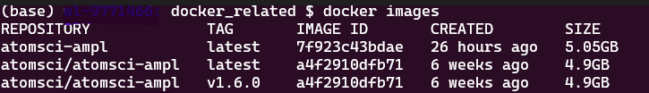

###########################
01 Install AMPL From Docker
###########################

*Published: June, 2024, ATOM DDM Team*

------------

The purpose of this tutorial is to install the `AMPL <https://github.com/ATOMScience-org/AMPL>`_ software using Docker, which will provide accessibility across multiple platforms. Here are the topics to be covered in this tutorial:

* :ref:`Create Docker`
   * :ref:`Prerequisite` 
   * :ref:`Option 1`
   * :ref:`Option 2`
* :ref:`Start container`
   * :ref:`Use existing`
* :ref:`Start Jupyter notebook`
   * :ref:`Connect Jupyter notebook`
   * :ref:`Use run kernel`
   * :ref:`Save work`
* :ref:`Examples`
* :ref:`Docker commands`
* :ref:`Troubleshootings`

.. note::
   
   *If you already have an AMPL image previously built from either option 1 or 2, go to this "Use an existing image to start a container" step to start/run a container.*

.. _Create Docker:

Create a Docker Image
*********************

.. _Prerequisite:

Prerequisite: Download and Install Docker
=========================================

If you don't have Docker Desktop installed, please follow instructions here: https://www.docker.com/get-started.

Once it's installed, click on the Docker icon to start. Leave it running when using Docker.

.. _Option 1:

Option 1: Build a Local AMPL Image Using **Dockerfile**
=======================================================

* Clone `AMPL <https://github.com/ATOMScience-org/AMPL>`_  github repo. 

.. code-block::

   git clone https://github.com/ATOMScience-org/AMPL.git  
   ### The following line is optional. If you want to check out a development branch instead of the default branch (master).
   git checkout 1.6.1                    # (optional) checkout a dev branch, 1.6.1 for example
   cd AMPL/docker                        # Dockerfile is in AMPL/docker direcotry

To build a Docker image

* Examples:

.. code-block::

  # example 1
  docker build -t atomsci-ampl .       # by default, "latest" will be the tag

  # or
  # example 2
  docker build -t atomsci-ampl:<tag> .            # specify a name for <tag>

This normally takes about 15-20 minutes to build. The image can be reused.

.. note::
    
    *To build without cache, add "--no-cache" flag after "docker build". For example, "docker build --no-cache -t atomsci-ampl ."*

Once it's built, follow the ":ref:`Start container`" step to run the `AMPL <https://github.com/ATOMScience-org/AMPL>`_ docker container.

.. _Option 2:

Option 2: Pull an Existing AMPL Image From a Docker Repo
========================================================

.. code-block::

    docker pull atomsci/atomsci-ampl:latest

.. _Start container:

Start a Docker Container
************************

.. _Use existing:

Use an Existing Image to Start a Container
==========================================

If you have an image built/downloaded, type "docker images" to see what images are currently available. 
Pick one and run it using the "docker run" command. For example:

* The "docker run" command syntax:

.. code-block::

    docker run -it -p <port>:<port> -v <local_folder>:<directory_in_docker> <IMAGE>

* Examples

.. code-block::
    
    # example 1 # if built from a Dockerfile
    docker run -it -p 8888:8888 -v ${PWD}:/home atomsci-ampl

    # or
    # example 2 # if pulled from atomsci
    docker run -it -p 8888:8888 -v ${PWD}:/home atomsci/atomsci-ampl

To get more info for the "docker run" command options, type "docker run --help". For example: 

.. code-block::

    -i, --interactive                    Keep STDIN open even if not attached
    -t, --tty                            Create a pseudo terminal
    -p, --publish port(s) list           Publish a container's port(s) to the host
    -v, --volume list                    Bind mount a volume </pre>

.. _Start Jupyter notebook:

Start the Jupyter Notebook From a Container
*******************************************

.. code-block::

    # inside docker container
    jupyter-notebook --ip=0.0.0.0 --allow-root --port=8888 &

    # -OR-
    jupyter-lab --ip=0.0.0.0 --allow-root --port=8888 &

This will output a message with similar URLs to this:

.. _Connect Jupyter notebook:

To Connect the Jupyter Notebook From a Browser
==============================================

Copy and paste the URL from the output message to the browser on your computer. For example:

.. image:: ../_static/img/01_install_with_docker_files/browser_url.png

.. note::

    *If this doesn't work, exit the container and choose a different port
    such as "7777" or "8899" (in all 3 places it's 
    written), then rerun both commands in "Start a Docker container" and 
    "Start the Jupyter notebook from a container". 
    Be sure to save any work in your container. This is because if the container 
    is shut down, you'll lose anything not in that folder. See instructions on "Save work from Docker Jupyter".*  

.. _Use run kernel:

Use **atomsci-env** As the Run Kernel for AMPL
==============================================

There are two ways to set a kernel:

* From a notebook, top menu bar "Kernel" > "Change Kernel" > "atomsci-env"

* Outside of a notebook, click "New" dropdown from upper right corner, and select **atomsci-env** as the run kernel

* The notebook would look like this:

.. _Save work:

Save Work From Docker Jupyter
=============================

A Docker container is stateless. Once you exit, the work will not persist. There are a couple of ways to save your files:

1) Use the browser Jupyter. Use "File" -> "Download" to download the file(s).

2) Use mount. When you start the Docker with "-v" option:

.. code-block::

   docker run -it -p <port>:<port> -v <local_folder>:<directory_in_docker> <IMAGE>

It binds the <local_folder> with <directory_in_docker>, meaning that the file(s) in <directory_in_docker>, will be available in <local_folder>.

For example:

* Run the docker with "-v" to bind the directories

.. code-block::

    docker run -it -p 8888:8888 -v ${PWD}:/home atomsci-ampl       # <local_folder> -> ${PWD}, <directory_in_docker> -> `/home`.

* Save, copy the file(s) to <directory_in_docker>

.. code-block::

    root@d8ae116b2a83:/AMPL# pwd
    /AMPL
    root@d8ae116b2a83:/AMPL# cp atomsci/ddm/examples/01_install_with_docker.md /home

* The file(s) will be in <local_folder>

.. _Examples:

Code Examples
==============

The `AMPL <https://github.com/ATOMScience-org/AMPL>`_ code is in:

.. code-block::

    # if start with a "jupyter-notebook" command
    http://127.0.0.1:`<port_number>`/tree/AMPL/atomsci/ddm/

    # -OR-
    # if start with a "jupyter-lab" command
    http://127.0.0.1:`<port_number>`/lab/atomsci/ddm/examples

.. note::
   
   *"<port_number>" is the number that you used when starting "docker run -p ...".*

The tutorials examples are in:

.. code-block::

    http://127.0.0.1:\ :raw-html-m2r:`<port_number>`\ /tree/AMPL/atomsci/ddm/examples/tutorials

    # -OR-
    http://127.0.0.1:\ :raw-html-m2r:`<port_number>`\ /lab/atomsci/ddm/examples/tutorials

Also, there are examples in `AMPL's Read the Docs <https://ampl.readthedocs.io/en/latest/>`_ on how to use the `AMPL <https://github.com/ATOMScience-org/AMPL>`_ Framework.

.. _Docker commands:

Useful Docker Commands
======================

.. code-block::

    docker run --help                                # get help messages
    docker ps -a                                     # check docker processes
    docker images                                    # list local docker images
    docker rmi `<image>`                             # remove an image
    docker cp file.txt `<container_id>`:/file.txt    # copy from local to container
    docker cp `<container_id>`:source_path dest_path # copy from container to local

.. _Troubleshootings:

Troubleshooting
===============

* Problem with token

If you try to connect the Jupyter Notebook URL, but got a prompt for password or token, go to the docker terminal, type in

.. code-block::

    jupyter server list

.. image:: ../_static/img/01_install_with_docker_files/jupyter_server_list.png

And copy the string after "token=" and  paste the token to log in

.. image:: ../_static/img/01_install_with_docker_files/localhost_token.png

Welcome to the ATOM Modeling PipeLine now that you have installed Docker! You are ready to use the `AMPL <https://github.com/ATOMScience-org/AMPL>`_ Tutorials on your journey to build a machine learning model. 

To kick-start the Tutorial series, check out **Tutorial 2, "Data Curation"** , to learn how to curate a dataset that will be used throughout the series.

If you have specific feedback about a tutorial, please complete the `AMPL Tutorial Evaluation <https://forms.gle/pa9sHj4MHbS5zG7A6>`_.
