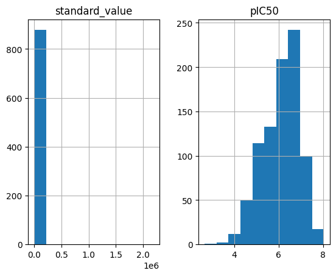
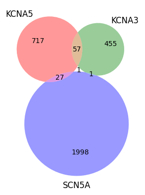

################
02 Data Curation
################

*Published: Nov, 2023, ATOM DDM Team*

------------

Curating raw data is a long, detailed process that takes several steps.
SMILES strings need to be standardized, meaurements in different units
need to be converted to a common unit, outliers need to be removed, and
duplicates need to be combined. These steps are vital to good data
science. Here we will cover some tools in AMPL that are used to perform
these steps.

-  ``base_smiles_from_smiles``
-  ``standardize_relations``
-  ``convert_IC50_to_pIC50``
-  ``remove_outlier_replicates``
-  ``aggregate_assay_data``

These are just a few of the steps needed to curate a dataset; another
tutorial will cover data curation in more detail.

Read the data
=============

We've prepared an example dataset containing IC50 values for the KCNA5
target collected from `ChEMBL <https://www.ebi.ac.uk/chembl/>`__. This
dataset is simpler than what is commonly found in the wild, but will
concisely demonstrate AMPL tools.

.. code:: ipython3

    import pandas as pd
    import numpy as np
    import sklearn as sns
    
    # read in data
    kcna5=pd.read_csv('dataset/kcna5_ic50.csv')

Columns
=======

This dataset is drawn from the ChEMBL database and contains the
following columns - ``molecule_chembl_id``: The ChEMBL id for the
molecule. - ``smiles``: The SMILES string that represents the molecule.
This is the main input taken by AMPL models. - ``standard_type``: This
column records the type of endpoint e.g., IC50, Ki, Kd, etc. This
dataset only contains IC50 data points. - ``standard_relation``: Data
points might be censored. This column records if the datapoint is
censored or not. - ``standard_value``: The IC50 value is recorded here.
- ``standard_units``: IC50 values can be recorded in different units
which are recorded here. Fortunately, all of this data uses nM.

.. code:: ipython3

    kcna5.shape

.. parsed-literal::

    (880, 6)

.. code:: ipython3

    kcna5.columns

.. parsed-literal::

    Index(['molecule_chembl_id', 'smiles', 'standard_type', 'standard_relation',
           'standard_value', 'standard_units'],
          dtype='object')

Standardize SMILES
==================

SMILES strings are not unique and the same compound can be represented
by different, not so equivalent, SMILES. This step simplifies the
machine learning problem by ensuring each compound is represented the
same way. 

.. note::

   **Beware!** The input to base\_smiles\_from\_smiles must be a ``list``.

.. code:: ipython3

    from atomsci.ddm.utils.struct_utils import base_smiles_from_smiles
    kcna5['base_rdkit_smiles'] = base_smiles_from_smiles(kcna5.smiles.tolist())
    
    kcna5.smiles.nunique(), kcna5.base_rdkit_smiles.nunique()

.. parsed-literal::

    (802, 802)

.. note::

   There are 802 unique SMILES from Chembl that are standardized
   to 802 unique smiles; sometimes two SMILES are standardized to the same
   thing. From now on we will use ``base_rdkit_smiles``.

Standardize Relations
=====================

Relations can also differ from database to database. This function will
standardize the relation column for use with AMPL. Since this data is
from ChEMBL, we will call the function with ``db='ChEMBL'``

.. code:: ipython3

    from atomsci.ddm.utils.data_curation_functions import standardize_relations
    kcna5 = standardize_relations(kcna5, db='ChEMBL', 
                        rel_col='standard_relation',
                        output_rel_col='fixed_relation')

    kcna5.standard_relation.value_counts()

.. parsed-literal::

    standard_relation
    '='    804
    '>'     74
    '~'      2
    Name: count, dtype: int64

.. code:: ipython3

    kcna5.fixed_relation.value_counts()

.. parsed-literal::

    fixed_relation
    =    806
    >     74
    Name: count, dtype: int64

Calculate pIC50s
================

We will convert the IC50s to pIC50s before performing machine learning.
This function will use ``standard_units`` and ``standard_value``
columns. This function converts IC50s in nM to pIC50s.

.. code:: ipython3

    from atomsci.ddm.utils.data_curation_functions import convert_IC50_to_pIC50
    kcna5 = convert_IC50_to_pIC50(kcna5, 
                                  unit_col='standard_units',
                                  value_col='standard_value',
                                  new_value_col='pIC50',
                                  unit_conv={'µM':lambda x: x*1e-6, 'nM':lambda x: x*1e-9},
                                  inplace=False)
    
    kcna5[['standard_value', 'pIC50']].hist()

.. parsed-literal::

    array([[<Axes: title={'center': 'standard_value'}>,
            <Axes: title={'center': 'pIC50'}>]], dtype=object)

Remove outliers and aggregate
=============================

The final step is to remove outliers and aggregate duplicate
measurements.

.. code:: ipython3

    from atomsci.ddm.utils.curate_data import remove_outlier_replicates, aggregate_assay_data
    
    kcna5_cur = remove_outlier_replicates(kcna5, id_col='molecule_chembl_id',
                                    response_col='pIC50')
    
    kcna5_cur = aggregate_assay_data(kcna5_cur, 
                                 value_col='pIC50',
                                 output_value_col='avg_pIC50',
                                 id_col='molecule_chembl_id',
                                 smiles_col='base_rdkit_smiles',
                                 relation_col='fixed_relation',
                                 label_actives=False,
                                 verbose=True
                            )
    
    kcna5_cur.to_csv('dataset/curated_kcna5_ic50.csv', index=False)

.. parsed-literal::

    Removed 1 pIC50 replicate measurements that were > 1.0 from median
    0 entries in input table are missing SMILES strings
    802 unique SMILES strings are reduced to 802 unique base SMILES strings

.. note::

    **Beware!** ``aggregate_assay_data`` changes ``molecule_chembl_id`` to
    ``compound_id``, ``fixed_relation`` to ``relation``, and will create the
    value column ``avg_pIC50``. The column ``active`` is added but is not
    used in this tutorial. It will be covered in a classification tutorial.

.. code:: ipython3

    kcna5.shape, kcna5_cur.shape

.. parsed-literal::

    ((880, 9), (802, 4))

.. code:: ipython3

    kcna5.columns

.. parsed-literal::

    Index(['molecule_chembl_id', 'smiles', 'standard_type', 'standard_relation',
           'standard_value', 'standard_units', 'base_rdkit_smiles',
           'fixed_relation', 'pIC50'],
          dtype='object')

.. code:: ipython3

    kcna5_cur.columns

.. parsed-literal::

    Index(['compound_id', 'base_rdkit_smiles', 'relation', 'avg_pIC50'], dtype='object')

All together, the curation process looks like this. We use this function
to curate two more datasets for related targets.

.. code:: ipython3

    import os
    
    def curate(df):
         df['base_rdkit_smiles'] = base_smiles_from_smiles(df.smiles.tolist())
    
         df = standardize_relations(df, db='ChEMBL', 
                        rel_col='standard_relation',
                        output_rel_col='fixed_relation')
    
         df = convert_IC50_to_pIC50(df, 
                                  unit_col='standard_units',
                                  value_col='standard_value',
                                  new_value_col='pIC50',
                                  unit_conv={'µM':lambda x: x*1e-6, 'nM':lambda x: x*1e-9},
                                  inplace=False)
    
         df = remove_outlier_replicates(df, id_col='molecule_chembl_id',
                                       response_col='pIC50')
    
         df = aggregate_assay_data(df, 
                                  value_col='pIC50',
                                  output_value_col='avg_pIC50',
                                  id_col='molecule_chembl_id',
                                  smiles_col='base_rdkit_smiles',
                                  relation_col='fixed_relation',
                                  label_actives=False
                             )
         return df
    
    for f in ['kcna3_ic50.csv', 'scn5a_ic50.csv']:
         print(f'{f}\n')
         df = pd.read_csv(os.path.join('dataset', f))
         print("Original data shape: ", df.shape)
         df = curate(df)
         print("Curated data shape: ", df.shape)
         print(df.columns, '\n')
         df.to_csv('dataset/curated_'+f, index=False)

.. parsed-literal::

    kcna3_ic50.csv
    
    Original data shape:  (891, 6)
    Removed 19 pIC50 replicate measurements that were > 1.0 from median
    Curated data shape:  (514, 4)
    Index(['compound_id', 'base_rdkit_smiles', 'relation', 'avg_pIC50'], dtype='object') 
    
    scn5a_ic50.csv
    
    Original data shape:  (2368, 6)
    Removed 20 pIC50 replicate measurements that were > 1.0 from median
    Curated data shape:  (2036, 4)
    Index(['compound_id', 'base_rdkit_smiles', 'relation', 'avg_pIC50'], dtype='object') 
    

Multi-task data
===============

Now that the data is curated we can combine it with 2 other datasets
that are already curated.

.. code:: ipython3

    kcna5 = pd.read_csv('dataset/curated_kcna5_ic50.csv')
    kcna3 = pd.read_csv('dataset/curated_kcna3_ic50.csv')
    scn5a = pd.read_csv('dataset/curated_scn5a_ic50.csv')
    
    df=kcna5.merge(kcna3, how='outer', on=['compound_id', 'base_rdkit_smiles',], suffixes=['_kcna5','_kcna3'])
    scn5a.columns=['compound_id', 'base_rdkit_smiles', 'relation_scn5a', 'avg_pIC50_scn5a']
    df = df.merge(scn5a, how='outer', on=['compound_id', 'base_rdkit_smiles'])
    print(df.columns)
    df.to_csv('dataset/kcna5_kcna3_scna5a.csv', index=False)

.. parsed-literal::

    Index(['compound_id', 'base_rdkit_smiles', 'relation_kcna5', 'avg_pIC50_kcna5',
           'relation_kcna3', 'avg_pIC50_kcna3', 'relation_scn5a',
           'avg_pIC50_scn5a'],
          dtype='object')

.. code:: ipython3

    df.head()

.. list-table:: 
   :widths: 3 5 20 5 5 5 5 5 5
   :header-rows: 1
   :class: tight-table 
 
   * -  
     - compound_id
     - base_rdkit_smiles
     - relation_kcna5
     - avg_pIC50_kcna5
     - relation_kcna3
     - avg_pIC50_kcna3
     - relation_scn5a
     - avg_pIC50_scn5a
   * - 0
     - CHEMBL3127405
     - NC(=O)c1ccc(N(Cc2ccc(F)cc2)S(=O)(=O)c2ccccc2F)cc1
     - NaN
     - 5.657577
     - NaN
     - NaN
     - NaN
     - NaN
   * - 1
     - CHEMBL1289071
     - CC(C)(CNC(=O)c1cc[nH]c1)CN(C1=NS(=O)(=O)c2cc(F...
     - NaN
     - 5.879426
     - NaN
     - 5.939302
     - NaN
     - NaN
   * - 2
     - CHEMBL2312933
     - CCCN(c1cccnc1)P(=O)(c1ccccc1)c1ccccc1
     - NaN
     - 6.920819
     - NaN
     - NaN
     - NaN
     - NaN
   * - 3
     - CHEMBL4100226
     - CN(C)C(=O)c1cccc(-c2ccccc2CC(c2cccnc2)c2cccnc2)c1
     - NaN
     - 7.193820
     - NaN
     - NaN
     - NaN
     - NaN
   * - 4
     - CHEMBL1090794
     - OC(c1cccnc1)(c1cccnc1)C(c1ccccc1)N1CCOCC1
     - NaN
     - 6.591760
     - NaN
     - NaN
     - NaN
     - NaN

|

This plot shows there are not many SMILES that overlap between the three
targets.

.. code:: ipython3

    import matplotlib_venn as mpv
    mpv.venn3([set(df.loc[~df.avg_pIC50_kcna5.isna(), 'base_rdkit_smiles']),
               set(df.loc[~df.avg_pIC50_kcna3.isna(), 'base_rdkit_smiles']),
               set(df.loc[~df.avg_pIC50_scn5a.isna(), 'base_rdkit_smiles']),],
              set_labels=['KCNA5','KCNA3','SCN5A'])

.. parsed-literal::

    <matplotlib_venn._common.VennDiagram at 0xffff143769d0>

