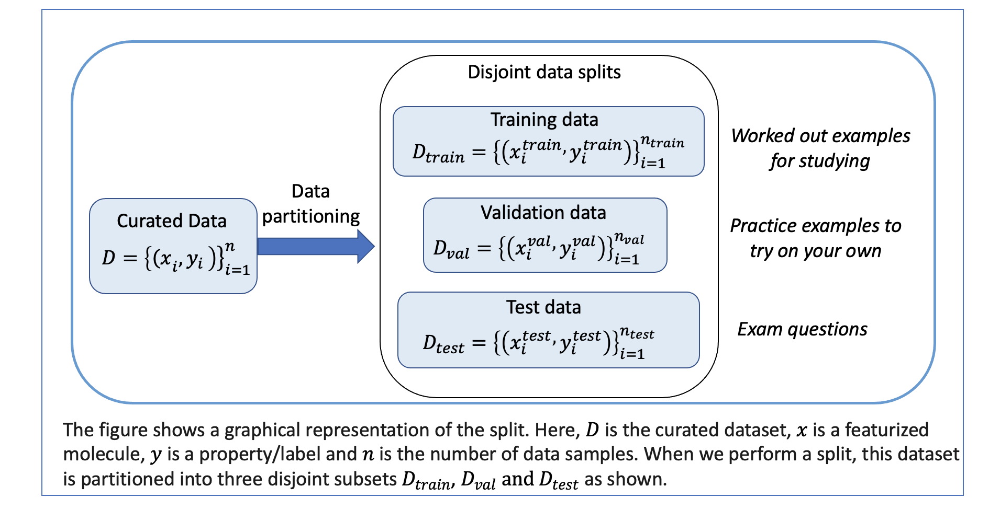
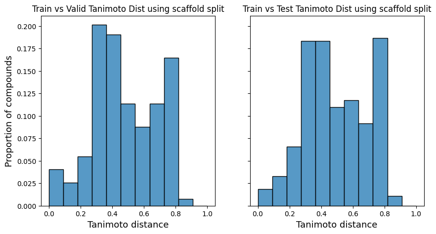
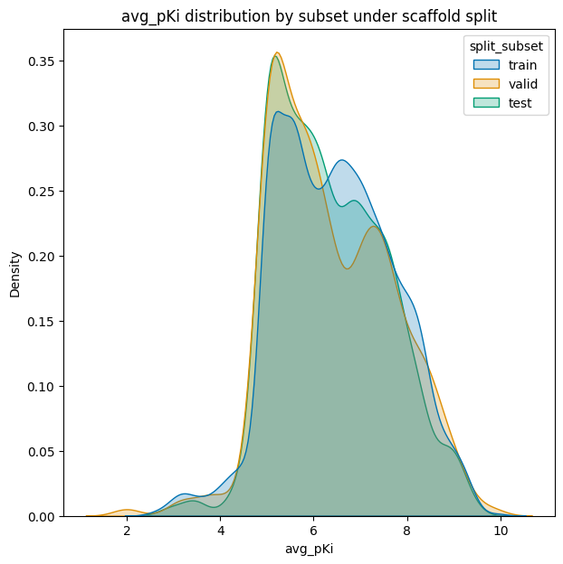

################################################
02 Splitting Datasets for Validation and Testing
################################################

*Published: June, 2024, ATOM DDM Team*

------------

A common problem with machine learning (ML) models is that they can very
easily "overfit" the training data. This means that the model predicts
the response values for training set compounds with perfect accuracy,
but fails miserably on molecules that differ from the training
compounds. To avoid overfitting and provide a way to test a model's
ability to generalize to new molecules, ML researchers have developed a
variety of data splitting and training schemes.
`AMPL <https://github.com/ATOMScience-org/AMPL>`_ supports two of
the most popular strategies: 

-  3-way training/validation/test splits 
-  *k*-fold cross-validation

In this tutorial we will perform a 3-way split of the curated dataset we
prepared in **Tutorial 1, "Data Curation"**, using the
`AMPL <https://github.com/ATOMScience-org/AMPL>`_ modules, classes
and functions listed below. *k*-fold cross-validation will be addressed
in a future tutorial.

-  `parameter_parser <https://ampl.readthedocs.io/en/latest/pipeline.html#pipeline-parameter-parser-module>`_
-  `ModelPipeline <https://ampl.readthedocs.io/en/latest/pipeline.html#pipeline.model_pipeline.ModelPipeline>`_
-  `split_dataset <https://ampl.readthedocs.io/en/latest/pipeline.html#pipeline.model_pipeline.ModelPipeline.split_dataset>`_
-  `compare_splits_plots <https://ampl.readthedocs.io/en/latest/utils.html#module-utils.compare_splits_plots>`_
-  `split_response_dist_plots <https://ampl.readthedocs.io/en/latest/utils.html#module-utils.split_response_dist_plots>`_

With 3-way data splitting, you divide your curated dataset into three
subsets:

.. list-table::
   :header-rows: 1
   :class: tight-table

   * - Subset
     - Description
   * - **Training set**
     - Usually the largest subset. `AMPL <https://github.com/ATOMScience-org/AMPL>`_ feeds the training set compound features and response values in batches to the model fitting algorithm. The fitting algorithm iteratively adjusts the model parameters after each batch so that the predicted responses are close (on average) to the actual response values.
   * - **Validation set**
     - Used after training a collection of models to see how well each one performs on "new" compounds that weren't used directly to fit the model parameters, so you can choose the best model. The validation set is also used by AMPL during **neural network model** training to implement "early stopping", a trick to avoid overfitting the training set.
   * - **Test set**
     - After training is completed, `AMPL <https://github.com/ATOMScience-org/AMPL>`_ scores the predictions on the test set compounds to provide a measure of the final model's performance.

.. code:: ipython3

    import pandas as pd
    
    # Set up
    dataset_file = 'dataset/SLC6A3_Ki_curated.csv'
    odir = 'dataset'
    
    # Set for less chatty log messages
    import logging
    logger = logging.getLogger('ATOM')
    logger.setLevel(logging.INFO)

Splitting Methods
*****************

`AMPL <https://github.com/ATOMScience-org/AMPL>`_ supports a
variety of splitting algorithms, including **random** and **scaffold splits**. 
A **scaffold** is the core structure of a molecule, with its
side chains removed. **Scaffold splits** assign molecules to the
training, validation and test sets, so that molecules with the same
scaffold group together in the same subset. This ensures that compounds
in the validation and test sets have different scaffolds from those in
the training set, and are thus more likely to be structurally different.
By contrast, a random split assigns molecules to subsets randomly.

Rationale for Using Scaffold vs Random Splits
=============================================

A **scaffold split** is more challenging for model fitting than a
**random split**. With a random split, many test set compounds may be
similar to molecules in the training set, so a model may *appear* to
perform well when it is simply "memorizing" training compound structures
associated with different response levels. Such a model will perform
badly on molecules that truly are different from the training compounds.
However, a model trained on molecules that belong to a limited set of
scaffold classes has to learn combinations of features that generalize
across many chemical families to make accurate predictions on compounds
with novel scaffolds. A scaffold split provides a way to select models
with greater generalization ability and assess their performance
realistically.

Performing a Split
******************

We start by constructing a dictionary of parameter values:

.. code:: ipython3

    params = {
        # dataset info
        "dataset_key" : dataset_file,
        "response_cols" : "avg_pKi",
        "id_col": "compound_id",
        "smiles_col" : "base_rdkit_smiles",
        "result_dir": odir,
    
        # splitting
        "previously_split": "False",
        "splitter": 'scaffold',
        "split_valid_frac": "0.15",
        "split_test_frac": "0.15",
    
        # featurization & training params
        "featurizer": "computed_descriptors",
        "descriptor_type" : "rdkit_raw",
        "previously_featurized": "True",
    }

We parse the ``params`` dict with the ``parameter_parser`` module to
create a parameter object for input to
`AMPL <https://github.com/ATOMScience-org/AMPL>`_ functions.

We then create a ``ModelPipeline`` object and call its ``split_dataset``
method to do the actual split.

.. note::
  
    *"split_dataset()" can also featurize the dataset; we will explore featurization in a later tutorial. 
    For now, we provide prefeaturized data in the "./dataset/scaled_descriptors" folder*

.. code:: ipython3

    from atomsci.ddm.pipeline import model_pipeline as mp
    from atomsci.ddm.pipeline import parameter_parser as parse
    
    pparams = parse.wrapper(params)
    MP = mp.ModelPipeline(pparams)
    split_uuid = MP.split_dataset()

The dataset split table is saved as a .csv in the same directory as the
``dataset_key``. The name of the split file starts with the
``dataset_key`` and is followed by the ``split_strategy``
(train\_valid\_test), ``split type`` (scaffold), and the ``split_uuid``
(a unique identifier of the split).

.. code:: ipython3

    # display the split file location
    import glob
    import os
    dirname = os.path.dirname(params['dataset_key'])
    split_file = glob.glob(f"{dirname}/*{split_uuid}*")[0]
    split_file

.. parsed-literal::

    'dataset/SLC6A3_Ki_curated_train_valid_test_scaffold_640d807b-f58a-47f3-913d-4a60db0a9dbd.csv'

Format of the Split File
************************

The split file consists of three columns: ``cmpd_id`` is the compound
ID; ``subset`` tells you if the compound is in the train, validation, or
test set and ``fold`` contains the fold index, which is used only by
*k*-fold cross-validation splits.

.. code:: ipython3

    # Explore contents of the split file
    split_df = pd.read_csv(split_file)
    split_df.head()

.. list-table:: 
   :header-rows: 1
   :class: tight-table 
 
   * -  
     - cmpd_id
     - subset
     - fold
   * - 0
     - CHEMBL498564
     - train
     - 0
   * - 1
     - CHEMBL1085567
     - train
     - 0
   * - 2
     - CHEMBL236473
     - train
     - 0
   * - 3
     - CHEMBL464422
     - train
     - 0
   * - 4
     - CHEMBL611677
     - train
     - 0

.. code:: ipython3

    # Show the numbers of compounds in each split subset
    split_df.subset.value_counts()

.. parsed-literal::

    subset
    train    1273
    valid     273
    test      273
    Name: count, dtype: int64

Visualizing Scaffold Splits
***************************

`Tanimoto
distance <https://en.wikipedia.org/wiki/Jaccard_index#Tanimoto_similarity_and_distance>`_
is a handy way to measure structural dissimilarity between compounds
represented using `ECFP
fingerprints <https://pubs.acs.org/doi/10.1021/ci100050t>`_.

We can use functions in the ``compare_splits_plots`` module to compute
`Tanimoto
distance <https://en.wikipedia.org/wiki/Jaccard_index#Tanimoto_similarity_and_distance>`_
between each validation and test set compound and its nearest neighbor
in the training set, and then plot the distribution of distances for
each subset.

.. code:: ipython3

    import seaborn as sns
    import matplotlib.pyplot as plt
    import atomsci.ddm.utils.compare_splits_plots as csp
    
    # read the dataset
    df = pd.read_csv('dataset/SLC6A3_Ki_curated.csv')
    
    # read the split file
    split = pd.read_csv(split_file)
    split_type = params['splitter']
    
    # create SplitStats
    ss = csp.SplitStats(df, split, smiles_col='base_rdkit_smiles', id_col='compound_id', response_cols=['avg_pKi'])
    
    # plot
    fig, ax = plt.subplots(1,2, sharey=True, figsize=(10,5))
    ss.dist_hist_train_v_valid_plot(ax=ax[0])
    ax[0].set_title(f"Train vs Valid Tanimoto Dist using {split_type} split")
    ss.dist_hist_train_v_test_plot(ax=ax[1])
    ax[1].set_title(f"Train vs Test Tanimoto Dist using {split_type} split");

The majority of compounds have `Tanimoto
distances <https://en.wikipedia.org/wiki/Jaccard_index#Tanimoto_similarity_and_distance>`_
between 0.2 and 0.8 from the training set, indicating that they are
structurally different from the training compounds. The distance
distributions are similar between the test and validation sets. This
indicates that a model selected based on its validation set performance
will likely have similar performance when evaluated on the test set.

We can also plot the distributions of the response values - the
:math:`pK_i`'s - in each subset. These plots can be useful in diagnosing
model performance problems; if the response distributions in the
training and test sets are dramatically different, it may be hard to
train a model that performs well on the test set.

.. code:: ipython3

    import atomsci.ddm.utils.split_response_dist_plots as srdp
    split_params = {
        "dataset_key" : dataset_file,
        "smiles_col" : "base_rdkit_smiles",
        "response_cols" : "avg_pKi",
        "split_uuid": split_uuid,
        "splitter": 'scaffold',
    }
    srdp.plot_split_subset_response_distrs(split_params)

For this dataset, the :math:`pK_i`'s have roughly similar distributions
across the **scaffold split** subsets, except that the training set has
slightly more compounds with large values.

In  **Tutorial 3, "Train a Simple Regression Model"**, we will use this
dataset and **scaffold split** to train a model to predict the
:math:`pK_i`'s.

If you have specific feedback about a tutorial, please complete the
`AMPL Tutorial Evaluation <https://forms.gle/pa9sHj4MHbS5zG7A6>`_.
