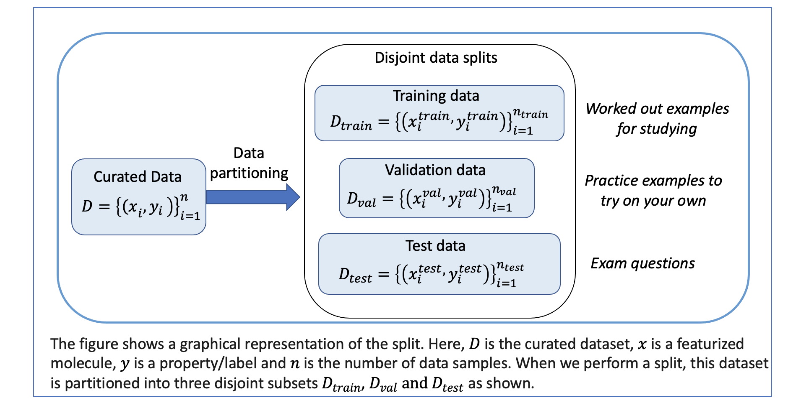
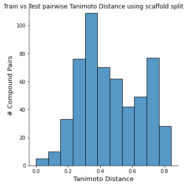
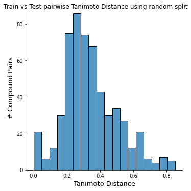

##################
03 Perform a Split
##################

*Published: Nov, 2023, ATOM DDM Team*

------------

One of the goals of machine learning is to build a model that can
generalize and perform well on new data. The problem is that you may not
have new data, but you can simulate this experience by splitting the
dataset into train, validation and test sets.

**Training set**: A subset of the main dataset will feed into the model
so that that model can learn the data patterns.

**Validation Set**: This subset helps evaluate if the model has trained
optimally. It also helps to set the parameters of the model.For
example:in neural networks (NN), we use the validation set to find the
number of epochs for training; NN's weights etc.

**Test set**: This set checks the final model’s accuracy.

Performing a split helps the model validation process to simulate how
your model perform with new data. This tutorial will cover some tools in
AMPL to perform a split.

.. code:: ipython3

    '''We will use the curated dataset that we created in tutorial 2 
    and learn how to split it into train,validation and test sets.'''
    
    import pandas as pd
    
    # Set up
    dataset_file = 'dataset/curated_kcna5_ic50.csv'
    odir='dataset'

Machine learning (ML) models learn the relationship between molecules
and molecular properties. These models can dramatically accelerate the
screening process by giving researchers information on which molecules
are most and least likely to have the desired properties.

ML models, however, are only as good as the data they were trained on.
In the chemical space, this problem manifests itself when a model is
queried with molecules from an unfamiliar chemical space.

Perform a Scaffold split
========================

Scaffolds' represent core structures of small molecules. Scaffold splits
group molecules with different scaffold structures into the training,
validation and test tests so that molecules with the same scaffold are
grouped together in the same subset.This ensures that the
train/validation/test sets are structurally different.

A scaffold split is more challenging than a random split where the data
are split into train/validation/test at random. If a model is trained on
molecules that belong to only a handful of scaffold classes, its ability
to predict a molecule in an unfamiliar scaffold is unknown.

.. code:: ipython3

    split_type=['scaffold','random']
    param_lst=[]
    for split_val in split_type :
        params = {
            "verbose": "True",
            "system": "LC",
    
            # dataset info
            "dataset_key" : dataset_file,
            "datastore": "False",
            "response_cols" : "avg_pIC50",
            "id_col": "compound_id",
            "smiles_col" : "base_rdkit_smiles",
            "result_dir": odir,
    
            # splitting
            "split_only": "True",
            "previously_split": "False",
            "splitter": split_val,
            "split_valid_frac": "0.15",
            "split_test_frac": "0.15",
    
            # featurization & training params
            "featurizer": "ecfp",
        }
        param_lst.append(params)

The dataset split table is saved as a .csv in the same directory as the
``dataset_key``. The name of the split file starts with the
``dataset_key`` and is followed by the split type (scaffold/random),
split strategy, and the split\_uuid; an unique identifier of the split.

.. code:: ipython3

    from atomsci.ddm.pipeline import model_pipeline as mp
    from atomsci.ddm.pipeline import parameter_parser as parse
    
    split_lst=[]
    for params in param_lst :
        pparams = parse.wrapper(params)
        MP = mp.ModelPipeline(pparams)
        split_uuid = MP.split_dataset()
        split_lst.append((params,split_uuid))

Rationale between using scaffold split and random split
=======================================================

A generalizable model will be able to accurately predict the properties
of molecules it has never seen before, reducing the need to perform
extensive manual assays each time a new chemical class is to be tested.
Generalizable models can predict across multiple different scaffolds and
molecule types, while a non-generalizable model cannot.

A scaffold split tests model generalizability better than a random
split. When using a random split, there is no guarantee that the test
set will be structurally different than the training sets.

.. code:: ipython3

    # display the split file location and names
    import os
    file_lst=[]
    for params, sid in split_lst :
        fname=params['dataset_key']
        dirname=os.path.dirname(fname)
        split_val=params['splitter']
    
        # find the file that contains the correct uuid
        all_files = os.listdir(dirname)
        for file in all_files:
            if sid in file:
                nfile = os.path.join(dirname, file)
                file_lst.append((nfile,sid,split_val))
                break
    print(file_lst)

.. parsed-literal::

    [('dataset/curated_kcna5_ic50_train_valid_test_scaffold_bcd96299-6d61-4467-9e6b-814dcf8cde16.csv', 'bcd96299-6d61-4467-9e6b-814dcf8cde16', 'scaffold'), ('dataset/curated_kcna5_ic50_train_valid_test_random_80f0616b-b3d6-46f2-abc1-23a55ccaed99.csv', '80f0616b-b3d6-46f2-abc1-23a55ccaed99', 'random')]

Format of the split file
========================

The split file consits of three columns: cmpd\_id is the compound id;
subset tells you if the compound is in the train/validation/ test set
and fold tell you which fold (Folds and split stratergies will be
explained in a later tutorial)

.. code:: ipython3

    # Explore contents of the split file
    file,sid,split_val = file_lst[0]
    df=pd.read_csv(file)
    df.head(3)

.. raw:: html

    

    <table cellspacing="1" cellpadding="2" class="dataframe">
      <thead>
        <tr style="text-align: right;">
          <th></th>
          <th>cmpd_id</th>
          <th>subset</th>
          <th>fold</th>
        </tr>
      </thead>
      <tbody>
        <tr>
          <th>0</th>
          <td>CHEMBL326282</td>
          <td>train</td>
          <td>0</td>
        </tr>
        <tr>
          <th>1</th>
          <td>CHEMBL475630</td>
          <td>train</td>
          <td>0</td>
        </tr>
        <tr>
          <th>2</th>
          <td>CHEMBL388538</td>
          <td>train</td>
          <td>0</td>
        </tr>
      </tbody>
    </table>
    

.. raw:: html

  

Show difference in Tanimoto distance between training and test comparison between random and scaffold split
~~~~~~~~~~~~~~~~~~~~~~~~~~~~~~~~~~~~~~~~~~~~~~~~~~~~~~~~~~~~~~~~~~~~~~~~~~~~~~~~~~~~~~~~~~~~~~~~~~~~~~~~~~~

.. code:: ipython3

    import atomsci.ddm.utils.compare_splits_plots as csp
    from atomsci.ddm.pipeline import chem_diversity as cd
    
    # read the dataset
    df = pd.read_csv('dataset/curated_kcna5_ic50.csv')
    
    for file, uuid, split_type in file_lst:
        # read the split file
        split = pd.read_csv(file)
    
        # create SplitStats
        ss = csp.SplitStats(df, split, smiles_col='base_rdkit_smiles', id_col='compound_id', response_cols=['avg_pIC50'])
    
        g = ss.dist_hist_train_v_test_plot()
        g.fig.suptitle(f"Train vs Test pairwise Tanimoto Distance using {split_type} split")

