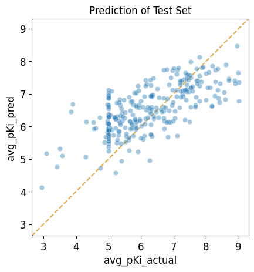

#################################
04 Application of a Trained Model
#################################

*Published: June, 2024, ATOM DDM Team*

------------

In this tutorial we will show you how to use a trained model to make
predictions for a new set of compounds. As an example, we will take the
model trained in "**Tutorial 3: Train a Simple Regression Model**",
which predicts :math:`pK_i` values for inhibition of SLC6A3, and apply
it to the test subset compounds from the original training dataset.
Since we know the actual :math:`pK_i` values for these compounds, we
will then plot the predicted values against the actual values to see how
well the model performs on this compound set.

This tutorial focuses on these
`AMPL <https://github.com/ATOMScience-org/AMPL>`_ functions:

-  `predict_from_model_file <https://ampl.readthedocs.io/en/latest/pipeline.html#pipeline.predict_from_model.predict_from_model_file>`_
-  `plot_pred_vs_actual_from_df <https://ampl.readthedocs.io/en/latest/pipeline.html#pipeline.perf_plots.plot_pred_vs_actual_from_df>`_

.. code:: ipython3

    import pandas as pd
    import numpy as np
    import matplotlib.pyplot as plt
    import seaborn as sns
    
    # ignore sklearn future warnings
    import warnings
    warnings.filterwarnings('ignore',category=FutureWarning)
    
    from atomsci.ddm.pipeline import predict_from_model as pfm
    from sklearn.metrics import r2_score

Creating The Test Dataset
*************************

First, create a test set by selecting the test data from the curated
dataset. Here we are using the pre-featurized dataset to save time.

.. code:: ipython3

    split_file_path = 'dataset/SLC6A3_Ki_curated_train_valid_test_scaffold_c35aeaab-910c-4dcf-8f9f-04b55179aa1a.csv'
    curated_data_path = 'dataset/scaled_descriptors/SLC6A3_Ki_curated_with_rdkit_raw_descriptors.csv'
    
    split_data = pd.read_csv(split_file_path)
    
    curated_data = pd.read_csv(curated_data_path)
    
    test_ids=split_data[split_data.subset == 'test'].cmpd_id.unique()
    test_data = curated_data[curated_data.compound_id.isin(test_ids)]
    
    # show most useful columns 
    test_data[['compound_id', 'base_rdkit_smiles', 'avg_pKi']].head()

.. list-table:: 
   :header-rows: 1
   :class: tight-table 
 
   * -  
     - compound_id
     - base_rdkit_smiles
     - avg_pKi
   * - 3
     - CHEMBL17157
     - CC(C)(C)c1ccc(C(O)CCCN2CCC(C(O)(c3ccccc3)c3ccc...
     - 6.692504
   * - 7
     - CHEMBL3321789
     - OC1(c2ccc(Cl)cc2)CC2CCC(C1)N2CCCOc1ccc(F)cc1
     - 6.207608
   * - 13
     - CHEMBL595638
     - CN1C2CCC1[C@@H](C(=O)OCc1cn(CCOC(=O)[C@H]3C4CC...
     - 7.795880
   * - 28
     - CHEMBL4447975
     - COc1cc(OC)c2c(c1)OC[C@@]1(C)NCC[C@@H]21
     - 5.000000
   * - 41
     - CHEMBL1062
     - CC(=O)[C@@]1(O)CC[C@H]2[C@@H]3CCC4=CC(=O)CC[C@...
     - 5.260744

Performing Predictions
**********************

Next, load a pretrained model from a model tarball file and run
predictions on compounds in the test set. If the original model
``response_col`` was ``avg_pKi``, the returned data frame will contain
columns ``avg_pKi_actual``, ``avg_pKi_pred``, and ``avg_pKi_std``. The
predictions of :math:`pK_i` are in the column, ``avg_pKi_pred``. The
``avg_pKi_std`` column contains uncertainity estimates (standard
deviations) for the predictions.

Here we set the ``is_featurized`` parameter to true, since we're using
the pre-featurized dataset.

.. note::
   
    *For the purposes of this tutorial, the following model
    has been altered to work on every file system. In general, to run a
    model that was trained on a different machine, you need to provide
    the path to the local copy of the training dataset as an additional
    parameter called "external_training_data".*

.. code:: ipython3

    model_dir = 'dataset/SLC6A3_models/SLC6A3_Ki_curated_model_9ff5a924-ef49-407c-a4d4-868a1288a67e.tar.gz'
    input_df = test_data
    id_col = 'compound_id'
    smiles_col = 'base_rdkit_smiles'
    response_col = 'avg_pKi'
    
    # loads a pretrained model from a model tarball file and runs predictions on 
    # compounds in an input data frame
    pred_df = pfm.predict_from_model_file(model_path = model_dir, 
                                          input_df = test_data,
                                          id_col = id_col ,
                                          smiles_col = smiles_col, 
                                          response_col = response_col,
                                          is_featurized=True)
                                          
    
    # show most useful columns
    pred_df[['compound_id', 'base_rdkit_smiles', 'avg_pKi_actual','avg_pKi_pred', 'avg_pKi_std']].head()

.. parsed-literal::

    Standardizing SMILES strings for 273 compounds.

.. list-table:: 
   :header-rows: 1
   :class: tight-table 
 
   * -  
     - compound_id
     - base_rdkit_smiles
     - avg_pKi_actual
     - avg_pKi_pred
     - avg_pKi_std
   * - 0
     - CHEMBL17157
     - CC(C)(C)c1ccc(C(O)CCCN2CCC(C(O)(c3ccccc3)c3ccc...
     - 6.692504
     - 7.741641
     - 1.289527
   * - 1
     - CHEMBL3321789
     - OC1(c2ccc(Cl)cc2)CC2CCC(C1)N2CCCOc1ccc(F)cc1
     - 6.207608
     - 6.607851
     - 1.069817
   * - 2
     - CHEMBL595638
     - CN1C2CCC1[C@@H](C(=O)OCc1cn(CCOC(=O)[C@H]3C4CC...
     - 7.795880
     - 6.784137
     - 1.271238
   * - 3
     - CHEMBL4447975
     - COc1cc(OC)c2c(c1)OC[C@@]1(C)NCC[C@@H]21
     - 5.000000
     - 6.080245
     - 1.321997
   * - 4
     - CHEMBL1062
     - CC(=O)[C@@]1(O)CC[C@H]2[C@@H]3CCC4=CC(=O)CC[C@...
     - 5.260744
     - 6.304104
     - 1.517846

Evaluating Prediction Performance
*********************************

Then, calculate the :math:`R^2` score and compare it with the expected
test :math:`R^2` score of 0.426594, reported in **Tutorial 3, "Train a
Simple Regression Model"**.

.. code:: ipython3

    actual_value = pred_df['avg_pKi_actual']
    predicted_value = pred_df['avg_pKi_pred']
    r2 = np.round(r2_score(actual_value, predicted_value), 6)
    r2

.. parsed-literal::

    0.426594

Visualizing Prediction Results
******************************

We can visualize the results in a scatter plot of predicted values vs.
actual values.

.. code:: ipython3

    from atomsci.ddm.pipeline import perf_plots as pp

.. code:: ipython3

    # Plots predicted vs actual values from a trained regression model for a given 
    # dataframe
    pp.plot_pred_vs_actual_from_df(pred_df, 
                                   actual_col='avg_pKi_actual', 
                                   pred_col='avg_pKi_pred', 
                                   label='Prediction of Test Set');

In **Tutorial 5, "Hyperparameter Optimization"**, we will move beyond a
single model and learn to optimize model hyperparameters by training
many models.

If you have specific feedback about a tutorial, please complete the
`AMPL Tutorial Evaluation <https://forms.gle/pa9sHj4MHbS5zG7A6>`_.
