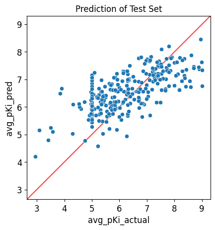

#################################
05 Application of a Trained Model
#################################

*Published: May, 2024, ATOM DDM Team*

------------

This tutorial will detail how to use the model from the "**Tutorial 4:
Train a Simple Regression Model**", to make predictions (:math:`pK_i`)
on the test set created based on the data split file from "**Tutorial 3:
Splitting Datasets for Validation and Testing**", and the curated
dataset from "**Tutorial 2: Data Curation**\ ”.

This tutorial focuses on these `AMPL <https://github.com/ATOMScience-org/AMPL>`_ functions:

-  `predict\_from\_model\_file <https://ampl.readthedocs.io/en/latest/pipeline.html#pipeline.predict_from_model.predict_from_model_file>`_
-  `plot\_pred\_vs\_actual\_from\_df <https://ampl.readthedocs.io/en/latest/pipeline.html#pipeline.perf_plots.plot_pred_vs_actual_from_df>`_

.. code:: ipython3

    import pandas as pd
    import numpy as np
    import matplotlib.pyplot as plt
    import seaborn as sns
    
    # ignore sklearn future warnings
    import warnings
    warnings.filterwarnings('ignore',category=FutureWarning)
    
    from atomsci.ddm.pipeline import predict_from_model as pfm
    from sklearn.metrics import r2_score

.. parsed-literal::

    Skipped loading some Jax models, missing a dependency. No module named 'jax'

First, create a test set by selecting the test data from the curated
dataset. Here we are using the pre-featurized dataset to save time.

.. code:: ipython3

    split_file_dir = 'dataset/SLC6A3_Ki_curated_train_valid_test_scaffold_c35aeaab-910c-4dcf-8f9f-04b55179aa1a.csv'
    curated_data_dir = 'dataset/scaled_descriptors/SLC6A3_Ki_curated_with_rdkit_raw_descriptors.csv'
    
    split_file = pd.read_csv(split_file_dir)
    split_file.rename(columns = {'cmpd_id': 'compound_id'}, inplace=True)
    
    curated_data = pd.read_csv(curated_data_dir)
    
    test_data = split_file[split_file['subset'] == 'test'].merge(curated_data, on='compound_id', how='left')
    test_data.head()

.. list-table:: 
   :widths: 3 5 5 5 5 5 5 5 5 5 5 5
   :header-rows: 1
   :class: tight-table 
 
   * -  
     - compound_id
     - subset
     - fold
     - base_rdkit_smiles
     - avg_pKi
     - MaxEStateIndex
     - MinEStateIndex
     - MinAbsEStateIndex
     - MaxAbsEStateIndex
     - qed
     - ...
   * - 0
     - CHEMBL66112
     - test
     - 0
     - Fc1ccc(CCN2CCCC(CNCCOC(c3ccccc3)c3ccccc3)C2)cc1
     - 7.000000
     - 14.525427
     - -5.202279
     - 14.525427
     - 1.190974
     - 0.395086
     - ...
   * - 1
     - CHEMBL633
     - test
     - 0
     - CCCCc1oc2ccccc2c1C(=O)c1cc(I)c(OCCN(CC)CC)c(I)c1
     - 5.701147
     - 14.597360
     - -4.424745
     - 14.597360
     - 0.755957
     - 0.167647
     - ...
   * - 2
     - CHEMBL394755
     - test
     - 0
     - O=C(CCCc1ccccc1)N1c2ccccc2Sc2ccccc21
     - 5.481486
     - 14.179167
     - -4.094387
     - 14.179167
     - 0.159457
     - 0.591963
     - ...
   * - 3
     - CHEMBL9514
     - test
     - 0
     - COC(=O)Nc1nc2cc(C(=O)c3cccs3)ccc2[nH]1
     - 5.305746
     - 12.895676
     - -3.188057
     - 12.895676
     - 0.191192
     - 0.728228
     - ...
   * - 4
     - CHEMBL4564992
     - test
     - 0
     - CN(CCOc1cc(COc2ccccc2)on1)C1CCCCC1
     - 5.000000
     - 8.755686
     - -4.710192
     - 8.755686
     - 0.873262
     - 0.734541
     - ...

Next, load a pretrained model from a model tarball file and run
predictions on compounds in the test set. If the original model
response\_col was ``avg_pKi``, the returned data frame will contain
columns ``avg_pKi_actual``, ``avg_pKi_pred``, and ``avg_pKi_std``. The
predictions of :math:`pK_i` is in the column, ``avg_pKi_pred``.

Here we set the ``is_featurized`` parameter to true, since we're using
the pre-featurized dataset.

.. note::
  
    *For the purposes of this tutorial, the following model
    has been altered to work on every file system. In general, to run a
    model that was trained on a different machine, you need to provide
    the path to the local copy of the training dataset as an additional
    parameter called ``external_training_data``.*

.. code:: ipython3

    model_dir = 'dataset/SLC6A3_models/SLC6A3_Ki_curated_model_8afb64d6-993e-4d8b-9072-60dcb40d2c83.tar.gz'
    input_df = test_data
    id_col = 'compound_id'
    smiles_col = 'base_rdkit_smiles'
    response_col = 'avg_pKi'
    
    # loads a pretrained model from a model tarball file and runs predictions on 
    # compounds in an input data frame
    pred_df = pfm.predict_from_model_file(model_path = model_dir, 
                                          input_df = test_data,
                                          id_col = id_col ,
                                          smiles_col = smiles_col, 
                                          response_col = response_col,
                                          is_featurized=True)
                                          
    pred_df.head()

.. parsed-literal::

    Standardizing SMILES strings for 273 compounds.

.. parsed-literal::

    INFO:atomsci.ddm.utils.model_version_utils:dataset/SLC6A3_models/SLC6A3_Ki_curated_model_8afb64d6-993e-4d8b-9072-60dcb40d2c83.tar.gz, 1.6.0
    INFO:atomsci.ddm.utils.model_version_utils:Version compatible check: dataset/SLC6A3_models/SLC6A3_Ki_curated_model_8afb64d6-993e-4d8b-9072-60dcb40d2c83.tar.gz version = "1.6", AMPL version = "1.6"
    WARNING:ATOM:['ampl_version', 'time_generated', 'time_built', 'dataset_hash', 'dataset_metadata', 'training_metrics'] are not part of the accepted list of parameters and will be ignored
    /home/apaulson/repos/AMPL_umbrella/AMPL/atomsci/ddm/pipeline/transformations.py:250: RuntimeWarning: invalid value encountered in divide
      X = np.nan_to_num((X - self.X_means) * X_weight / self.X_stds)

.. parsed-literal::

    num_model_tasks is deprecated and its value is ignored.

.. list-table:: 
   :widths: 3 5 5 5 5 5 5 5 5 5 5 5
   :header-rows: 1
   :class: tight-table 
 
   * -  
     - compound_id
     - subset
     - fold
     - base_rdkit_smiles
     - avg_pKi
     - MaxEStateIndex
     - MinEStateIndex
     - MinAbsEStateIndex
     - MaxAbsEStateIndex
     - qed
     - ...
   * - 0
     - CHEMBL66112
     - test
     - 0
     - Fc1ccc(CCN2CCCC(CNCCOC(c3ccccc3)c3ccccc3)C2)cc1
     - 7.000000
     - 14.525427
     - -5.202279
     - 14.525427
     - 1.190974
     - 0.395086
     - ...
   * - 1
     - CHEMBL633
     - test
     - 0
     - CCCCc1oc2ccccc2c1C(=O)c1cc(I)c(OCCN(CC)CC)c(I)c1
     - 5.701147
     - 14.597360
     - -4.424745
     - 14.597360
     - 0.755957
     - 0.167647
     - ...
   * - 2
     - CHEMBL394755
     - test
     - 0
     - O=C(CCCc1ccccc1)N1c2ccccc2Sc2ccccc21
     - 5.481486
     - 14.179167
     - -4.094387
     - 14.179167
     - 0.159457
     - 0.591963
     - ...
   * - 3
     - CHEMBL9514
     - test
     - 0
     - COC(=O)Nc1nc2cc(C(=O)c3cccs3)ccc2[nH]1
     - 5.305746
     - 12.895676
     - -3.188057
     - 12.895676
     - 0.191192
     - 0.728228
     - ...
   * - 4
     - CHEMBL4564992
     - test
     - 0
     - CN(CCOc1cc(COc2ccccc2)on1)C1CCCCC1
     - 5.000000
     - 8.755686
     - -4.710192
     - 8.755686
     - 0.873262
     - 0.734541
     - ...
          

Then, calculate the :math:`R^2` score and compare it with the expected
test :math:`R^2` score of ``0.416391``, reported in **Tutorial 4, "Train
a Simple Regression Model"**.

.. code:: ipython3

    actual_value = pred_df['avg_pKi_actual']
    predicted_value = pred_df['avg_pKi_pred']
    r2 = np.round(r2_score(actual_value, predicted_value), 6)
    r2

.. parsed-literal::

    0.416391

Last, visualize the results in a scatter plot of predicted values.

.. code:: ipython3

    from atomsci.ddm.pipeline import perf_plots as pp

.. code:: ipython3

    # Plots predicted vs actual values from a trained regression model for a given 
    # dataframe
    pp.plot_pred_vs_actual_from_df(pred_df, 
                                   actual_col='avg_pKi_actual', 
                                   pred_col='avg_pKi_pred', 
                                   label='Prediction of Test Set');

In **Tutorial 6, "Hyperparameter Optimization"** we will move beyond a
single model and learn to optimize model hyperparameters by training
many models.
