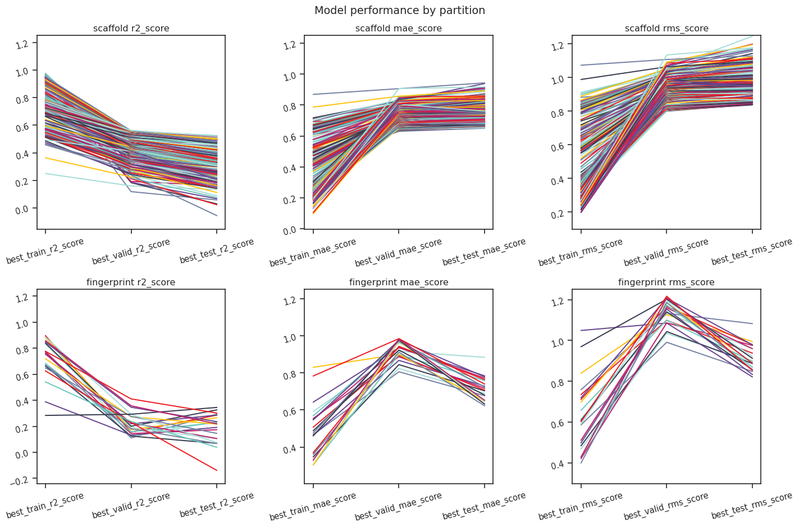
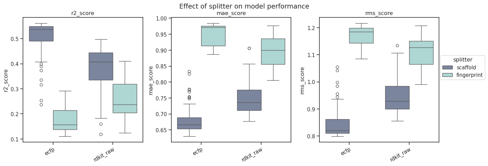
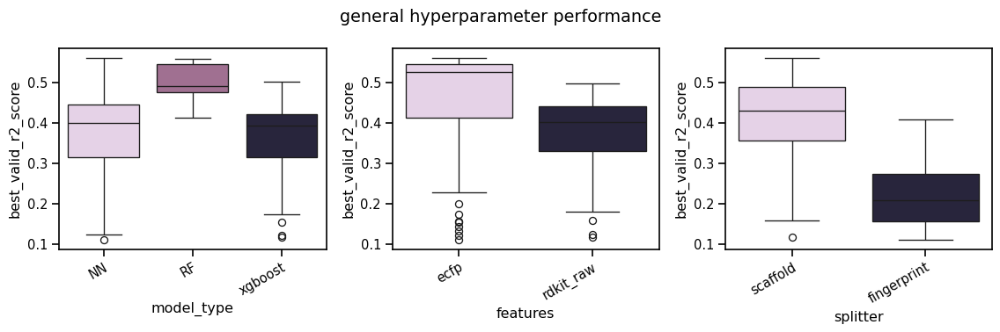
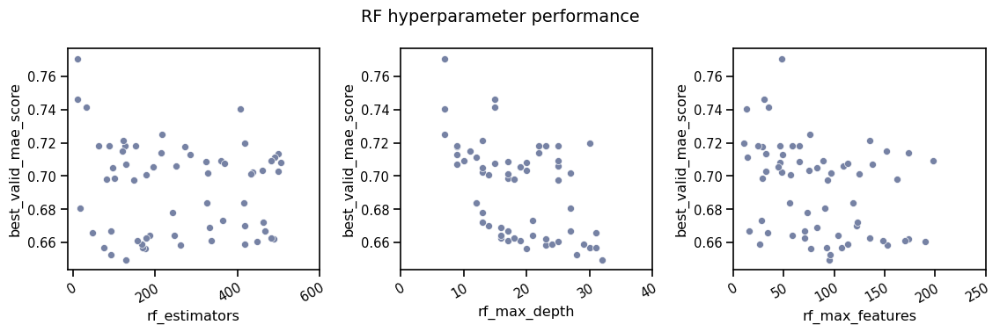
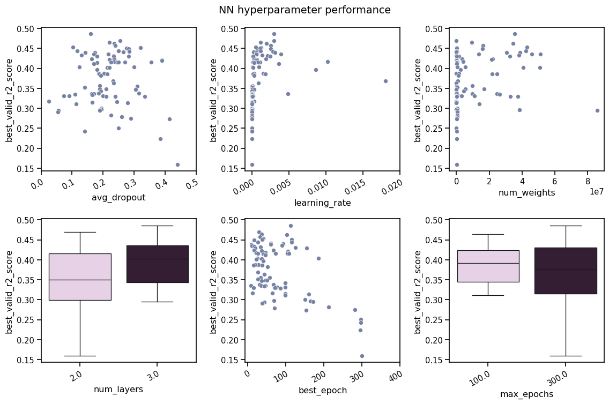
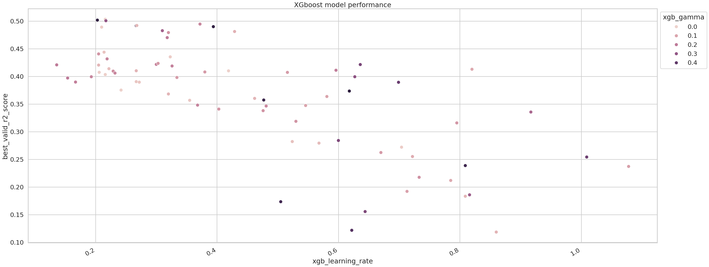
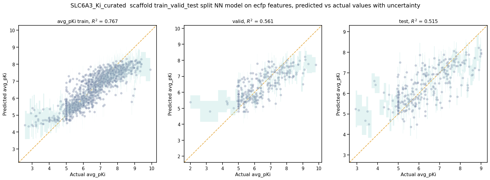
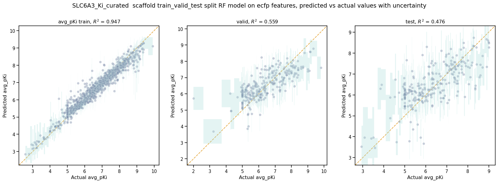

####################################################
06 Compare Models to Select the Best Hyperparameters
####################################################

*Published: June, 2024, ATOM DDM Team*

------------

This tutorial will review
`AMPL <https://github.com/ATOMScience-org/AMPL>`_ functions for
visualizing the results of a hyperparameter search in order to find the
optimal hyperparameters for your model.

After performing a hyperparameter search, it is prudent to examine each
hyperparameter in order to determine the best combination before
training a production model with all of the data. Additionally, it is
good to explore multiple performance metrics and visualize the
predictions instead of relying solely on metrics.

For the purposes of this tutorial, we simply ran **Tutorial 5,
"Hyperparameter Optimization"**, with different parameters such as those
outlined
`here <https://github.com/ATOMScience-org/AMPL#hyperparameter-optimization>`_ 
to get enough models for comparison. Specifically, we created additional
**NN** and `XGBoost <https://en.wikipedia.org/wiki/XGBoost>`_
models as well as using **fingerprint** and **scaffold splits**. If you
don't want to run that many models, you can use the ``result_df`` saved
here: ``dataset/SLC6A3_models/07_example_pred_df.csv``.

In this tutorial, we will focus on these functions:

-  `plot_train_valid_test_scores <https://ampl.readthedocs.io/en/latest/pipeline.html#pipeline.hyper_perf_plots.plot_train_valid_test_scores>`_
-  `plot_split_perf <https://ampl.readthedocs.io/en/latest/pipeline.html#pipeline.hyper_perf_plots.plot_split_perf>`_
-  `plot_hyper_perf <https://ampl.readthedocs.io/en/latest/pipeline.html#pipeline.hyper_perf_plots.plot_hyper_perf>`_
-  `get_score_types <https://ampl.readthedocs.io/en/latest/pipeline.html#pipeline.hyper_perf_plots.get_score_types>`_
-  `plot_xg_perf <https://ampl.readthedocs.io/en/latest/pipeline.html#pipeline.hyper_perf_plots.plot_xg_perf>`_
-  `plot_pred_vs_actual_from_file <https://ampl.readthedocs.io/en/latest/pipeline.html#pipeline.perf_plots.plot_pred_vs_actual_from_file>`_

Import Packages
***************

.. code:: ipython3

    from atomsci.ddm.pipeline import compare_models as cm
    from atomsci.ddm.pipeline import hyper_perf_plots as hpp
    from atomsci.ddm.pipeline import perf_plots as pp
    import pandas as pd
    pd.set_option('display.max_columns', None)
    
    # ignore warnings in tutorials
    import warnings
    warnings.filterwarnings('ignore', category=FutureWarning)
    warnings.filterwarnings('ignore', category=RuntimeWarning)

Get Model Results and Filter
****************************

First we pull the results of the hyperparameter search into a dataframe.
In **Tutorial 5, "Hyperparameter Optimization"**, we used
``get_filesystem_perf_results()`` which packs hyperparameters in a dict
in the column ``model_parameters_dict``. Here we use the individual
hyperparameter columns to create visualizations.

The ``result_df`` used here as an example is the result of calling
``get_filesystem_perf_results()`` once after training several hundred
models with different parameters. These models were all saved in a
single folder, but the function works iteratively so it can search an
entire directory tree if a parent folder is passed.

.. code:: ipython3

    # # call the function yourself
    # result_df=cm.get_filesystem_perf_results(result_dir='dataset/SLC6A3_models/', pred_type='regression')
    
    # use example results
    result_df=pd.read_csv('dataset/SLC6A3_models/07_example_pred_df.csv', index_col=0)
    
    result_df=result_df.sort_values('best_valid_r2_score', ascending=False)
    print(result_df.shape)
    
    # show useful columns 
    result_df[['model_uuid', 'split_uuid', 'best_train_r2_score', 'best_valid_r2_score', 'best_test_r2_score']].head()

.. parsed-literal::

    (467, 41)

.. list-table:: 
   :header-rows: 1
   :class: tight-table 
 
   * - 
     - model_uuid
     - split_uuid
     - best_train_r2_score
     - best_valid_r2_score
     - best_test_r2_score
   * - 310
     - b24a2887-8eca-43e2-8fc2-3642189d2c94
     - c35aeaab-910c-4dcf-8f9f-04b55179aa1a
     - 0.776865
     - 0.562091
     - 0.519325
   * - 306
     - 9b6c9332-15f3-4f96-9579-bf407d0b69a8
     - c35aeaab-910c-4dcf-8f9f-04b55179aa1a
     - 0.950677
     - 0.559590
     - 0.480895
   * - 291
     - d8e25713-bf6c-4ba0-917a-69f0ea1472b9
     - c35aeaab-910c-4dcf-8f9f-04b55179aa1a
     - 0.930726
     - 0.557156
     - 0.497192
   * - 334
     - 1a3e4b13-f860-4acf-8300-e2ac5766caa6
     - c35aeaab-910c-4dcf-8f9f-04b55179aa1a
     - 0.801391
     - 0.556679
     - 0.523567
   * - 321
     - 57a62e20-f18e-4afa-8ce2-315f0fcc950a
     - c35aeaab-910c-4dcf-8f9f-04b55179aa1a
     - 0.780693
     - 0.556103
     - 0.521270

We can look at a brief count of models for important parameters by
creating a pivot table. Here we can see `ECFP
fingerprints <https://pubs.acs.org/doi/10.1021/ci100050t>`_ and
`RDKit <https://github.com/rdkit/rdkit>`_ features and
**fingerprint** and **scaffold splitters** were used for each model
type. A fingerprint splitter provides a more stringent test of model
performance by making sure the validation and test compounds are
structurally dissimilar to the training set compounds.

.. code:: ipython3

    # model counts
    model_counts=pd.DataFrame(result_df.groupby(['features','splitter','model_type'])['model_uuid'].count()).reset_index()
    model_counts=model_counts.pivot(index='model_type',columns=['splitter','features',], values='model_uuid')
    model_counts

.. list-table:: 
   :header-rows: 3
   :class: tight-table 
 
   * - splitter
     - fingerprint
     - scaffold
     - fingerprint
     - scaffold
   * - features
     - ecfp
     - ecfp
     - rdkit_raw
     - rdkit_raw
   * - model_type
     -      
     -      
     -      
     -      
   * - **NN**
     - 26
     - 29
     - 25
     - 96
   * - **RF**
     - 30
     - 30
     - 30
     - 32
   * - **xgboost**
     - 47
     - 26
     - 20
     - 76

Often, certain random combinations of hyperparameters result in terribly
performing models. Here we will filter those out so they don't affect
the visualization by only keeping models with a validation ``r2_score``
of 0.1 or greater.

.. code:: ipython3

    result_df.best_valid_r2_score.describe()

.. parsed-literal::

    count    4.670000e+02
    mean    -6.111789e+73
    std      1.320769e+75
    min     -2.854206e+76
    25%     -2.751967e-01
    50%      2.719028e-01
    75%      4.323609e-01
    max      5.620908e-01
    Name: best_valid_r2_score, dtype: float64

.. code:: ipython3

    # filter out objectively bad performing models
    result_df=result_df[result_df.best_valid_r2_score>0.1]
    result_df.shape

.. parsed-literal::

    (264, 41)

.. code:: ipython3

    result_df.best_valid_r2_score.describe()

.. parsed-literal::

    count    264.000000
    mean       0.405931
    std        0.108515
    min        0.110739
    25%        0.337459
    50%        0.418931
    75%        0.484987
    max        0.562091
    Name: best_valid_r2_score, dtype: float64

After filtering out models with extremely poor metrics, we can see that
some combinations don't work at all, and are completely filtered from
the set. For example, decision tree based models using
`RDKit <https://github.com/rdkit/rdkit>`_ or
`ECFP <https://pubs.acs.org/doi/10.1021/ci100050t>`_ features work
very poorly to predict on fingerprint-split models.

.. code:: ipython3

    #  model counts
    model_counts=pd.DataFrame(result_df.groupby(['features','splitter','model_type'])['model_uuid'].count()).reset_index()
    model_counts=model_counts.pivot(index='model_type',columns=['splitter','features',], values='model_uuid')
    model_counts

.. list-table:: 
   :header-rows: 3
   :class: tight-table 
 
   * - splitter
     - fingerprint
     - scaffold
     - fingerprint
     - scaffold
   * - features
     - ecfp
     - ecfp
     - rdkit_raw
     - rdkit_raw
   * - model_type
     -      
     -      
     -      
     -      
   * - **NN**
     - 8.0		
     - 23.0
     - 11.0
     - 86.0
   * - **RF**
     - NaN
     - 30.0
     - NaN
     - 32.0
   * - **xgboost**
     - 3.0			
     - 21.0
     - NaN
     - 50.0

Visualize Hyperparameters
*************************

There are several plotting functions in the ``hyper_perf_plots`` module
that help visualize the different combinations of features for each type
of model.

Examine overall scores
----------------------

``plot_train_valid_test_scores()`` gives a quick snapshot of your
overall model performance. You can see if you overfitted and get a sense
of whether your partitions are a good representation of future
performance. Because the splitter can have a drastic effect on model
performance, these plots are also separated by split type.

Here we see a fairly typical pattern where the training set metrics are
higher than validation and test partitions. It is good to see that the
validation and test scores are similar across many models, indicating
that the models should generalize to new data well. For fingerprint
splits, we see an odd trend where the model performs *better* on the
test set than the validation set (remember - we want to minimize MAE or
RMSE!), suggesting that the split is problematic since the validation
set does not necessarily reflect the generalization capability of the
model accurately.

.. code:: ipython3

    hpp.plot_train_valid_test_scores(result_df, prediction_type='regression')

Examine Splits
--------------

``plot_split_perf()`` plots the performance of each split type,
separated by feature type, for each performance metric.

We can see that **fingerprint splits** perform much worse than
**scaffold splits** for this dataset, and but
`RDKit <https://github.com/rdkit/rdkit>`_ and
`ECFP <https://pubs.acs.org/doi/10.1021/ci100050t>`_ features
perform differently.
`ECFP <https://pubs.acs.org/doi/10.1021/ci100050t>`_ features work
better for scaffold splits while
`RDKit <https://github.com/rdkit/rdkit>`_ features work better for
**fingerprint splits**. Recalling the filtering from above, we know that
`RDKit <https://github.com/rdkit/rdkit>`_ features for
**fingerprint splits** are only represented by **NN** models, which may
skew these results.

.. code:: ipython3

    hpp.plot_split_perf(result_df, subset='valid')

General Model Features
======================

We also want to understand general hyperparameters like model type and
feature type and their effect on performance. We can use
``plot_hyper_perf()`` with ``model_type='general'`` as a shortcut to
visualize these.

We can see that **random forests** or **neural networks** perform the
best while `ECFP <https://pubs.acs.org/doi/10.1021/ci100050t>`_
features perform better than **RDKit**. Additionally, the **random
forest** models are very consistent while there is more variability in
the **NN** and **XGBoost** model performance.

.. code:: ipython3

    hpp.plot_hyper_perf(result_df, model_type='general')

RF-specific Hyperparameters
---------------------------

We can also use ``plot_hyper_perf()`` to visualize model-specific
hyperparameters. In this case we examine random forest models because
they generally perform the best for this dataset.

Here, we can see two distinct sets of ``valid_r2_scores`` (probably from
**fingerprint** vs **scaffold split** models), but both sets show
similar trends. For ``rf_estimators`` it looks like 100-150 trees is
optimal, while ``rf_max_depth`` does worse below ~15 and improves slowly
after that. ``rf_max_features`` doesn't show a clear trend except that
below 50 might result in worse models.

.. code:: ipython3

    hpp.plot_hyper_perf(result_df, model_type='RF', subset='valid', scoretype='r2_score')

.. image:: ../_static/img/06_compare_models_files/06_compare_models_21_0.png

We can quickly get a list of scores to plot with ``get_score_types()``
and create the same plots with different metrics.

.. code:: ipython3

    hpp.get_score_types()

.. parsed-literal::

    Classification metrics:  ['roc_auc_score', 'prc_auc_score', 'precision', 'recall_score', 'npv', 'accuracy_score', 'kappa', 'matthews_cc', 'bal_accuracy']
    Regression metrics:  ['r2_score', 'mae_score', 'rms_score']

.. code:: ipython3

    hpp.plot_hyper_perf(result_df, model_type='RF', subset='valid', scoretype='mae_score')

NN Visualization
================

When visualizing hyperparameters of NN models in this case, it is
slightly hard to see important trends because there is a large variance
in their model performance. To avoid this, we use ``plot_hyper_perf()``
with a subsetted dataframe to look at a single combination of splitter
and features.

.. list-table:: 
   :header-rows: 1
   :class: tight-table 
   
   * - Plot Features
     - Description
   * - `avg_dropout`
     - The average of dropout proportions across all layers of the model. This parameter can affect the generalizability and overfitting of the model and usually dropout of 0.1 or higher is best.
   * - `learning_rate`
     - The learning rate during training. Generally, learning rates that are ~10e-3 do best.
   * - `num_weights`
     - The product of layer sizes plus number of nodes in first layer, a rough estimate of total model size/complexity. This parameter should be minimized by selecting the smallest layer sizes possible that still maximize the preferred metric
   * - `num_layers`
     - The number of layers in the NN, another marker of complexity. This should also be minimized.
   * - `best_epoch`
     - Which epoch had the highest performance metric during training. This can indicate problematic training if the best_epochs are very small.
   * - `max_epochs`
     - The max number of epochs the model was allowed to train (although "early stopping" may have occurred). If the max_epochs is too small you may underfit your model. This could be shown by all of your best_epochs being at max_epoch.
.. code:: ipython3

    subsetted=result_df[result_df.splitter=='scaffold']
    subsetted=subsetted[subsetted.features=='rdkit_raw']
    hpp.plot_hyper_perf(subsetted, model_type='NN')

XGBoost Visualization
=====================

Using ``plot_xg_perf()``, we can simultaneously visualize the two most
important parameters for
`XGBoost <https://en.wikipedia.org/wiki/XGBoost>`_ models - the
learning rate and gamma. We can see that ``xgb_learning_rate`` should be
between 0 and 0.45, after which the performance starts to deteriorate.
There's no clear trend for ``xgb_gamma``. We can additionally use
``plot_hyper_perf()`` to visualize more
`XGBoost <https://en.wikipedia.org/wiki/XGBoost>`_ parameters, but
this is not shown here.

.. code:: ipython3

    # hpp.plot_hyper_perf(result_df, model_type='xgboost')

.. code:: ipython3

    hpp.plot_xg_perf(result_df)

Evaluation of a Single Model
****************************

After calling ``compare_models.get_filesystem_perf_results()``, the
dataframe can be sorted according to the score you care about. The
column ``model_parameters_dict`` contains hyperparameters used for the
best model. We can visualize this model using
``perf_plots.plot_pred_vs_actual_from_file()``.

.. note::

    *Not all scores should be maximized. For example,
    "mae_score" or "rms_score" should be minimized instead.*

.. code:: ipython3

    winnertype='best_valid_r2_score'
    
    # result_df=cm.get_filesystem_perf_results(result_dir='dataset/SLC6A3_models/', pred_type='regression')
    
    result_df=pd.read_csv('dataset/SLC6A3_models/07_example_pred_df.csv', index_col=0)
    result_df=result_df.sort_values(winnertype, ascending=False)
    result_df[['model_type','features','splitter',"dropouts",'best_train_r2_score','best_valid_r2_score','best_test_r2_score','model_uuid']].head()

.. list-table:: 
   :header-rows: 1
   :class: tight-table 
   
   * -
     - model_type
     - features
     - splitter
     - dropouts
     - best_train_r2_score
     - best_valid_r2_score
     - best_test_r2_score
     - model_uuid
   * - 310
     - NN
     - ecfp
     - scaffold
     - 0.28,0.30,0.30
     - 0.776865
     - 0.562091
     - 0.519325
     - b24a2887-8eca-43e2-8fc2-3642189d2c94
   * - 306
     - RF
     - ecfp
     - scaffold
     - NaN
     - 0.950677
     - 0.559590
     - 0.480895
     - 9b6c9332-15f3-4f96-9579-bf407d0b69a8
   * - 291
     - RF
     - ecfp
     - scaffold
     - NaN
     - 0.930726
     - 0.557156
     - 0.497192
     - d8e25713-bf6c-4ba0-917a-69f0ea1472b9
   * - 334
     - NN
     - ecfp
     - scaffold
     - 0.40,0.26,0.00
     - 0.801391
     - 0.556679
     - 0.523567
     - 1a3e4b13-f860-4acf-8300-e2ac5766caa6
   * - 321
     - NN
     - ecfp
     - scaffold
     - 0.39,0.05,0.10
     - 0.780693
     - 0.556103
     - 0.521270
     - 57a62e20-f18e-4afa-8ce2-315f0fcc950a

We can examine important parameters of the top model directly from the
``result_df``.

We see that through hyperparameter optimization, we have increased our
``best_valid_r2_score`` to 0.56, as compared to our baseline model
``valid_r2_score`` of 0.50011 (from **Tutorial 3, "Train a Simple
Regression Model"**).

.. code:: ipython3

    result_df.iloc[0][['features','splitter','best_valid_r2_score']]

.. parsed-literal::

    features                   ecfp
    splitter               scaffold
    best_valid_r2_score    0.562091
    Name: 310, dtype: object

.. code:: ipython3

    result_df.iloc[0].model_parameters_dict

.. parsed-literal::

    '{"best_epoch": 24, "dropouts": [0.27866421599874197, 0.3041982566364109, 0.29943876674824], "layer_sizes": [369, 283, 146], "learning_rate": 8.28816038984145e-05, "max_epochs": 100}'

.. code:: ipython3

    result_df.iloc[0].model_path

.. parsed-literal::

    'dataset/SLC6A3_models/SLC6A3_Ki_curated_model_b24a2887-8eca-43e2-8fc2-3642189d2c94.tar.gz'

Here we use ``plot_pred_vs_actual_from_file()`` to visualize the
prediction accuracy for the train, validation and test sets.

.. code:: ipython3

    # plot best model, an NN
    import importlib
    importlib.reload(pp)
    model_path=result_df.iloc[0].model_path
    pp.plot_pred_vs_actual_from_file(model_path)

.. parsed-literal::

    2024-06-25 18:59:07,633 dataset/SLC6A3_models/SLC6A3_Ki_curated_model_b24a2887-8eca-43e2-8fc2-3642189d2c94.tar.gz, 1.6.0
    2024-06-25 18:59:07,634 Version compatible check: dataset/SLC6A3_models/SLC6A3_Ki_curated_model_b24a2887-8eca-43e2-8fc2-3642189d2c94.tar.gz version = "1.6", AMPL version = "1.6"

.. parsed-literal::

    ['/tmp/tmph9rlkgwn/best_model/checkpoint1.pt']
    /tmp/tmph9rlkgwn/best_model/checkpoint1.pt

This NN model looks like it isn't very good at predicting things with
:math:`pKi` < 4.5. Additionally, there is a set of data at
:math:`pKi` =5 (this data is censored and all we know is that the
compounds have a :math:`pKi` < 5 because higher concentrations of drug
were not tested). This data is poorly predicted by the NN model. 

.. note::
   
    *Be wary of selecting models only based on their performance
    metrics! As we can see, this NN has problems even though the r2_score
    is fairly high.*

.. code:: ipython3

    # plot best RF model
    model_type='RF'
    model_path=result_df[result_df.model_type==model_type].iloc[0].model_path
    pp.plot_pred_vs_actual_from_file(model_path)
    print('\nBest valid r2 score: ',result_df[result_df.model_type==model_type].iloc[0].best_valid_r2_score)
    print('\nModel Parameters: ',result_df[result_df.model_type==model_type].iloc[0].model_parameters_dict,'\n')

.. parsed-literal::

    
    Best valid r2 score:  0.5595899501867392
    
    Model Parameters:  {"rf_estimators": 129, "rf_max_depth": 32, "rf_max_features": 95} 
    

This RF model looks like it did better at training than the best NN
model, even though its performance validation score is slightly lower.
The low :math:`pKi` values are learned more accurately in the training
set, and the censored data at :math:`pKi` =5 is also predicted more
accurately.

.. code:: ipython3

    # plot best xgboost model
    model_type='xgboost'
    model_path=result_df[result_df.model_type==model_type].iloc[0].model_path
    pp.plot_pred_vs_actual_from_file(model_path)
    print('\nBest valid r2 score: ',result_df[result_df.model_type==model_type].iloc[0].best_valid_r2_score)
    print('\nModel Parameters: ',result_df[result_df.model_type==model_type].iloc[0].model_parameters_dict,'\n')

.. parsed-literal::

    
    Best valid r2 score:  0.5031490908520113
    
    Model Parameters:  {"xgb_colsample_bytree": 1.0, "xgb_gamma": 0.0019288871251215423, "xgb_learning_rate": 0.2158168689218416, "xgb_max_depth": 6, "xgb_min_child_weight": 1.0, "xgb_n_estimators": 100, "xgb_subsample": 1.0} 
    

.. image:: ../_static/img/06_compare_models_files/06_compare_models_42_2.png

This `XGBoost <https://en.wikipedia.org/wiki/XGBoost>`_ model
learns the low :math:`pKi` values better but still suffers from problems
with predicting the censored data.

Moving forward, we would select the **RF** model as the best performer.

In **Tutorial 7, "Train a Production Model"**, we will use the
best-performing parameters to create a production model for the entire
dataset.

If you have specific feedback about a tutorial, please complete the
`AMPL Tutorial Evaluation <https://forms.gle/pa9sHj4MHbS5zG7A6>`_.
