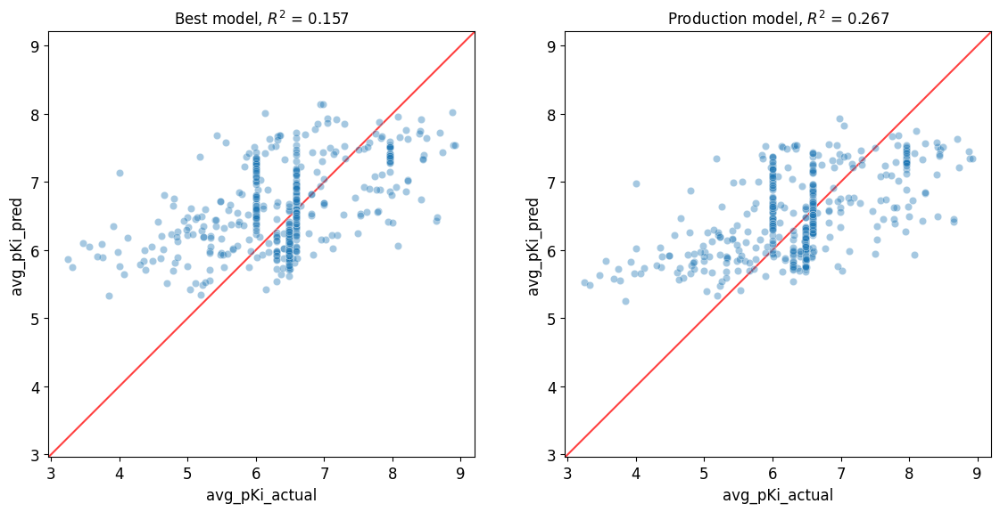

###########################
08 Train a Production Model
###########################

*Published: June, 2024, ATOM DDM Team*

------------

In this tutorial, you will use the existing hyperparameters that yielded
the best performing model in the previous **Tutorial 7, "Compare models
to select the best hyperparameters"** to train a production model on the
full dataset, rather than just the training subset from a **scaffold
split**. Training a model on the full dataset is one approach for
creating a production model. Another approach, not demonstrated in this
tutorial, is to combine the training and validation subsets for training
and evaluating with the test subset. `K-fold cross
validation <https://en.wikipedia.org/wiki/Cross-validation_(statistics)#k-fold_cross-validation>`_
makes use of this approach. The production model could be shared with
other researchers to predict on new data.

We will use the functions below to retrain the best original model for
production and compare the production model with the original model.
**We use the word "retrain" here to describe creating a new model based
on the same hyperparameters; retraining doesn't replace the existing
model.**

We will use functions covered in **Tutorial 5, "Train a Simple
Regression Model"** to evaluate the original and production models on an
external test dataset.

We will focus on these functions in this tutorial:

-  `create_prediction_pipeline_from_file <https://ampl.readthedocs.io/en/latest/pipeline.html#pipeline.model_pipeline.create_prediction_pipeline_from_file>`_
-  `train_model_from_tar <https://ampl.readthedocs.io/en/latest/utils.html#utils.model_retrain.train_model_from_tar>`_

.. note::

    *1. "train_model_from_tar" and other functions in the
    "model_retrain" module can be used to update a previously trained
    model when there is a new
    AMPL release that
    is not compatible with previous versions. This is not covered in
    this tutorial.*

    *2. When a model input dataset is updated with additional data, the
    model should be trained from scratch with a new hyperparameter
    optimization run; then a new version of the production model
    can be generated*.

Import Packages
***************

.. code:: ipython3

    import pandas as pd
    import os
    from atomsci.ddm.utils import model_retrain as mr
    from atomsci.ddm.utils import model_version_utils as mv
    from atomsci.ddm.pipeline import model_pipeline as mp
    from atomsci.ddm.pipeline import predict_from_model as pfm
    from atomsci.ddm.pipeline import perf_plots as pp
    from sklearn.metrics import r2_score
    import numpy as np
    import matplotlib.pyplot as plt
    
    import warnings
    warnings.filterwarnings('ignore', category=FutureWarning)

Start From Saved Best Model
***************************

We're using the best performing model by validation set :math:`R^2` from
**Tutorial 7, "Compare models to select the best hyperparameters"**.
This was a **random forest** model. The model path, validation set
:math:`R^2` and RF-specific parameters were as follows:

    dataset/SLC6A3\_models/SLC6A3\_Ki\_curated\_model\_9b6c9332-15f3-4f96-9579-bf407d0b69a8.tar.gz

    Best valid r2 score: 0.5595899501867392

    Model Parameters: {"rf\_estimators": 129, "rf\_max\_depth": 32,
    "rf\_max\_features": 95}

When you load a previously trained model, either for running predictions
or retraining, the parameters used to train the model are obtained from
a file called 'model\_metadata.json' that is stored in the model's
.tar.gz file. The ``production`` parameter controls whether the data is
split into training, validation and test sets. During normal training
and hyperparameter optimization, the ``production`` parameter is set
False; setting it True causes all splitting related parameters to be
ignored. When you call ``train_model_from_tar`` with the ``production``
argument set True, the code overrides the ``production`` parameter in
the model parameters to set it True, so that all the data is used for
training.

In the following code, ``create_prediction_pipeline_from_file`` is used
to reload the original best model. We then verify that it was trained
with ``production`` set to ``False``.

We also check the `AMPL <https://github.com/ATOMScience-org/AMPL>`_
version to make sure the saved model was trained with a version of
`AMPL <https://github.com/ATOMScience-org/AMPL>`_ that is
compatible with the installed version. The versions must be compatible
in order to be used by ``create_prediction_pipeline_from_file``, which
we will be calling later to run predictions from the saved model.

.. code:: ipython3

    #Tutorial 7 RF saved model_path
    best_model_path='dataset/SLC6A3_models/SLC6A3_Ki_curated_model_9b6c9332-15f3-4f96-9579-bf407d0b69a8.tar.gz'
    
    #get installed AMPL version
    print("installed AMPL version: " + str(mv.get_ampl_version()))
    
    #get AMPL model version
    print("best model AMPL version: " + str(mv.get_ampl_version_from_model(best_model_path)))
    
    # check versions are compatible
    assert(mv.check_version_compatible(best_model_path))
    
    #load best model production params
    best_model_pipe = mp.create_prediction_pipeline_from_file(params=None, reload_dir=None, model_path=best_model_path, model_type='best_model', featurization=None, verbose=False)
    
    #show production is false
    print("orig_params.production: " + str(best_model_pipe.orig_params.production))

Retrain Best Model as Production Model
**************************************

Setting the ``production`` argument for ``train_model_from_tar`` to
``True`` will set ``production=True`` in the model params. If the
``production`` argument for ``train_model_from_tar`` is ``False``, the
model will be retrained without changing any parameters. Note the
production model's model parameter ``production`` is set to ``True``.

.. code:: ipython3

    odir='dataset/SLC6A3_models'
    
    production_model = mr.train_model_from_tar(input=best_model_path, output=odir, production=True)
    
    #check for parameters
    print("production_model.params.production: " + str(production_model.params.production))
    print("production_model.params.model_tarball_path: " + str(production_model.params.model_tarball_path))
    
    print("production model AMPL version: " + str(mv.get_ampl_version_from_model(production_model.params.model_tarball_path)))

Compare Performance on a Separate External Test Dataset
*******************************************************

Here we will apply **Tutorial 5, "Application of a Trained Model"**'s
steps to run predictions with the original best model and the production
model, using an independent dataset of compounds that are structurally
different (with Tanimoto distance > 0.4) from all compounds in the
production dataset. We use this approach to compare the performance of
the two models. Since the production model is trained on all data,
including the test subset, the original test subset **should not** be
used to evaluate its performance.

First we'll load the external test dataset, which we've already
featurized with `RDKit <https://github.com/rdkit/rdkit>`_
descriptors:

.. code:: ipython3

    test_file_path = 'dataset/scaled_descriptors/SLC6A3_Ki_ext_test_data_with_rdkit_raw_descriptors.csv'
    test_data = pd.read_csv(test_file_path)
    
    test_data.head()

.. list-table:: 
   :widths: 3 5 5 5 5 5 5 5 5 5 5 5 
   :header-rows: 1
   :class: tight-table 
 
   * -  
     - compound_id
     - base_rdkit_smiles
     - avg_pKi
     - MaxEStateIndex
     - MinEStateIndex
     - MaxAbsEStateIndex     
     - MinAbsEStateIndex
     - qed
     - MolWt
     - HeavyAtomMolWt
     - ...
   * - 0
     - compound_346
     - OC(C[NH2+]C1CCC1)C1(c2ccc(Cl)c(Cl)c2)CCC1
     - 7.958607
     - 8.970106
     - -4.751902
     - 8.970106
     - 0.825260
     - 0.861181
     - 315.264
     - 293.088
     - ...
   * - 1
     - compound_225
     - CN1Cc2ccccc2C(C)(c2ccc3[nH]ncc3c2)C1
     - 6.587660
     - 8.993202
     - -4.010824
     - 8.993202
     - 0.226986
     - 0.739733
     - 277.371
     - 258.219
     - ...
   * - 2
     - compound_166
     - O=C(O)C(/C=C/c1ccccc1)C1CCN(CCOC(c2ccccc2)c2cc...
     - 5.430275
     - 13.525088
     - -5.060732
     - 13.525088
     - 1.095764
     - 0.412331
     - 455.598
     - 422.334
     - ...
   * - 3
     - compound_310
     - CN1Cc2cc(-c3cccnn3)ccc2C(C)(c2cc3ccccc3[nH]2)C1
     - 6.000000
     - 9.204719
     - -4.140132
     - 9.204719
     - 0.018450
     - 0.581059
     - 354.457
     - 332.281
     - ...
   * - 4
     - compound_284
     - CN1Cc2ccccc2C(F)(c2ccc3sccc3c2)C1
     - 6.587660
     - 17.710445
     - -4.117619
     - 17.710445
     - 0.229708
     - 0.636234
     - 297.398
     - 281.270
     - ...

We now predict :math:`pK_i` values with the original best model:

.. code:: ipython3

    id_col = 'compound_id'
    smiles_col = 'base_rdkit_smiles'
    response_col = 'avg_pKi'
    
    best_pred_df = pfm.predict_from_model_file(model_path = best_model_path, 
                                          input_df = test_data,
                                          id_col = id_col ,
                                          smiles_col = smiles_col, 
                                          response_col = response_col,
                                          is_featurized=False) #throws error if is_featurized=True
                                          
    best_pred_df.head()

.. list-table:: 
   :widths: 3 5 5 5 5 5 5 5 5 5 5 5 
   :header-rows: 1
   :class: tight-table 
 
   * -  
     - compound_id
     - base_rdkit_smiles
     - avg_pKi
     - MaxEStateIndex
     - MinEStateIndex
     - MaxAbsEStateIndex
     - MinAbsEStateIndex
     - qed
     - MolWt
     - HeavyAtomMolWt
     - ...
   * - 0
     - compound_346
     - OC(C[NH2+]C1CCC1)C1(c2ccc(Cl)c(Cl)c2)CCC1
     - 7.958607
     - 8.970106
     - -4.751902
     - 8.970106
     - 0.825260
     - 0.861181
     - 315.264
     - 293.088
     - ...
   * - 1
     - compound_225
     - CN1Cc2ccccc2C(C)(c2ccc3[nH]ncc3c2)C1
     - 6.587660
     - 8.993202
     - -4.010824
     - 8.993202
     - 0.226986
     - 0.739733
     - 277.371
     - 258.219
     - ...
   * - 2
     - compound_166
     - O=C(O)C(/C=C/c1ccccc1)C1CCN(CCOC(c2ccccc2)c2cc...
     - 5.430275
     - 13.525088
     - -5.060732
     - 13.525088
     - 1.095764
     - 0.412331
     - 455.598
     - 422.334
     - ...
   * - 3
     - compound_310
     - CN1Cc2cc(-c3cccnn3)ccc2C(C)(c2cc3ccccc3[nH]2)C1
     - 6.000000
     - 9.204719
     - -4.140132
     - 9.204719
     - 0.018450
     - 0.581059
     - 354.457
     - 332.281
     - ...
   * - 4
     - compound_284
     - CN1Cc2ccccc2C(F)(c2ccc3sccc3c2)C1
     - 6.587660
     - 17.710445
     - -4.117619
     - 17.710445
     - 0.229708
     - 0.636234
     - 297.398
     - 281.270
     - ...

Now we'll run predictions on the same dataset with the production model:

.. code:: ipython3

    prod_pred_df = pfm.predict_from_model_file(model_path = production_model.params.model_tarball_path, 
                                          input_df = test_data,
                                          id_col = id_col ,
                                          smiles_col = smiles_col, 
                                          response_col = response_col,
                                          is_featurized=False)
                                          
    prod_pred_df.head()

.. list-table:: 
   :widths: 3 5 5 5 5 5 5 5 5 5 5 5 
   :header-rows: 1
   :class: tight-table
 
   * - 
     - compound_id
     - base_rdkit_smiles
     - avg_pKi
     - MaxEStateIndex
     - MinEStateIndex
     - MaxAbsEStateIndex
     - MinAbsEStateIndex
     - qed
     - MolWt
     - HeavyAtomMolWt
     - ...
   * -  0
     - compound_346
     - OC(C[NH2+]C1CCC1)C1(c2ccc(Cl)c(Cl)c2)CCC1
     - 7.958607
     - 8.970106
     - -4.751902
     - 8.970106
     - 0.825260
     - 0.861181
     - 315.264
     - 293.088
     - ...
   * -  1
     - compound_225
     - CN1Cc2ccccc2C(C)(c2ccc3[nH]ncc3c2)C1
     - 6.587660
     - 8.993202
     - -4.010824
     - 8.993202
     - 0.226986
     - 0.739733
     - 277.371
     - 258.219
     - ...
   * - 2
     - compound_166
     - O=C(O)C(/C=C/c1ccccc1)C1CCN(CCOC(c2ccccc2)c2cc...
     - 5.430275
     - 13.525088
     - -5.060732
     - 13.525088
     - 1.095764
     - 0.412331
     - 455.598
     - 422.334
     - ...
   * - 3
     - compound_310
     - CN1Cc2cc(-c3cccnn3)ccc2C(C)(c2cc3ccccc3[nH]2)C1
     - 6.000000
     - 9.204719
     - -4.140132
     - 9.204719
     - 0.018450
     - 0.581059
     - 354.457
     - 332.281
     - ...
   * - 4
     - compound_284
     - CN1Cc2ccccc2C(F)(c2ccc3sccc3c2)C1
     - 6.587660
     - 17.710445
     - -4.117619
     - 17.710445
     - 0.229708
     - 0.636234
     - 297.398
     - 281.270
     - ...

To compare the performance of the production model with the original
best model, we'll compute the :math:`R^2` scores for the predictions
from each model and then plot the predicted vs actual values:

.. code:: ipython3

    best_r2 = np.round(r2_score(best_pred_df.avg_pKi_actual.values, best_pred_df.avg_pKi_pred.values), 6)
    prod_r2 = np.round(r2_score(prod_pred_df.avg_pKi_actual.values, prod_pred_df.avg_pKi_pred.values), 6)
    print("Best model r2_score: " + str(best_r2))
    print("Production model r2_score: " + str(prod_r2))

.. code:: ipython3

    fig, ax = plt.subplots(1,2, figsize=(12,6))
    pp.plot_pred_vs_actual_from_df(best_pred_df, actual_col='avg_pKi_actual', pred_col='avg_pKi_pred', 
        label=f"Best model, $R^2$ = {best_r2:.3f}", ax=ax[0])
    pp.plot_pred_vs_actual_from_df(prod_pred_df, actual_col='avg_pKi_actual', pred_col='avg_pKi_pred', 
        label=f"Production model, $R^2$ = {prod_r2:.3f}", ax=ax[1])
    fig.tight_layout(pad=3.0)
    fig.show()

Although neither model has a great :math:`R^2` score, the production
model *does* perform better, with :math:`R^2` = 0.267 vs 0.157 for the
original best model. Also, the points in the production model plot are
slightly more concentrated along the diagonal. A possible explanation
for the mediocre performance is that the external dataset compounds were
filtered so that none have Tanimoto distance < 0.4 to any compound in
the original model dataset, so that the test set compounds are outside
of the `applicability
domain <https://en.wikipedia.org/wiki/Applicability_domain>`_ of both
models. We expect that the models' performance would improve on a
dataset filtered with a smaller `Tanimoto
distance <https://en.wikipedia.org/wiki/Jaccard_index#Tanimoto_similarity_and_distance>`_
threshold.

Developing models that generalize well to diverse sets of compounds
(i.e., that have a broader applicability domain) is one of the major
challenges in machine learning for chemistry. Training a **production
model** is one approach to this problem. To do better we may need to
explore other model types or methods of featurizing molecules, with
additional rounds of **hyperparameter optimization**.

Other Functions With Production Parameters
******************************************

A boolean ``production`` parameter is available in these other functions
in the `AMPL <https://github.com/ATOMScience-org/AMPL>`_
``model_retrain`` module. If ``production`` is set to True, the model
will be trained in production mode, using the entire dataset for
training. Note that for **neural network models**, the model will be
trained for the number of epochs corresponding to the best epoch from
the original model training run. -
`train\_model <https://ampl.readthedocs.io/en/latest/utils.html#utils.model_retrain.train_model>`_
-
`train\_models\_from\_dataset\_keys <https://ampl.readthedocs.io/en/latest/utils.html#utils.model_retrain.train_models_from_dataset_keys>`_

In **Tutorial 9, "Visualizations of Model Performances"**, we'll explore
a wide range of methods for visualizing and evaluating the performance
of `AMPL <https://github.com/ATOMScience-org/AMPL>`_ models.

If you have specific feedback about a tutorial, please complete the `AMPL Tutorial Evaluation <https://forms.gle/pa9sHj4MHbS5zG7A6>`_.
