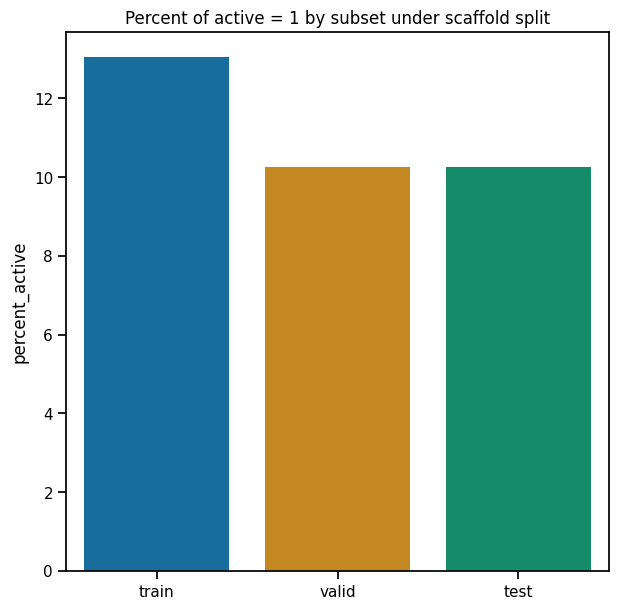

######################################
08 Visualizations of Model Performance
######################################

*Published: June, 2024, ATOM DDM Team*

------------

In this tutorial, we will use some of the tools provided by
`AMPL <https://github.com/ATOMScience-org/AMPL>`_ to visualize the
model training process and the performance of the final model. Some of
the tools we'll apply here are only applicable to certain classes of
models; as we go along we will indicate where each function can be
applied.

The tutorial will present the following functions, all from the
``perf_plots`` module: 

-  `plot_perf_vs_epoch <https://ampl.readthedocs.io/en/latest/pipeline.html#pipeline.perf_plots.plot_perf_vs_epoch>`_
-  `plot_pred_vs_actual <https://ampl.readthedocs.io/en/latest/pipeline.html#pipeline.perf_plots.plot_pred_vs_actual>`_
-  `plot_confusion_matrices <https://ampl.readthedocs.io/en/latest/pipeline.html#pipeline.perf_plots.plot_confusion_matrices>`_
-  `plot_model_metrics <https://ampl.readthedocs.io/en/latest/pipeline.html#pipeline.perf_plots.plot_model_metrics>`_
-  `plot_ROC_curve <https://ampl.readthedocs.io/en/latest/pipeline.html#pipeline.perf_plots.plot_ROC_curve>`_
-  `plot_prec_recall_curve <https://ampl.readthedocs.io/en/latest/pipeline.html#pipeline.perf_plots.plot_prec_recall_curve>`_

We will use the same training dataset and **scaffold split** as in
**Tutorial 3, "Train a Simple Regression Model**", to create some
**neural network models** and visualize their iterative training
process. Later, we'll generate a binary classification dataset based on
the same data, so we can train **classification models** and show the
visualizations that are specific to classifiers. For starters, let's
import some standard packages and modules:

.. code:: ipython3

    import pandas as pd
    import numpy as np
    import json
    
    # Set for less chatty log messages
    import logging
    logger = logging.getLogger('ATOM')
    logger.setLevel(logging.INFO)
    
    from atomsci.ddm.pipeline import model_pipeline as mp
    from atomsci.ddm.pipeline import parameter_parser as parse
    from atomsci.ddm.pipeline import perf_plots as pp

Visualizing the Training Process for a Neural Network Regression Model
**********************************************************************

When you train a **neural network model**,
`AMPL <https://github.com/ATOMScience-org/AMPL>`_ makes a series of
iterations through the entire training subset of your curated dataset;
each iteration is called an **epoch**. At the end of each epoch,
`AMPL <https://github.com/ATOMScience-org/AMPL>`_ saves the model
parameters (i.e., the weights of each network connection) in a
checkpoint file. It then computes and stores a set of metrics describing
the model's performance at that stage of training: the :math:`R^2` value
for regression models and the **ROC AUC** for classification models. By
default these metrics are used to select the epoch yielding the best
validation set performance; but you may choose a different metric by
setting the ``model_choice_score_type`` parameter. The metrics are
evaluated separately for the training, validation and test subsets.
Generally, the training set metrics continue to improve with more
epochs, while the validation and test set metrics reach a peak and then
decline, as the model becomes overfitted to the training subset. The
function ``plot_perf_vs_epoch`` allows you to visualize this process.

The code below will train a simple fully-connected neural network on the
`SLC6A3 <https://www.ebi.ac.uk/chembl/target_report_card/CHEMBL238/>`_
dataset. By default,
`AMPL <https://github.com/ATOMScience-org/AMPL>`_ uses an **early
stopping** algorithm to terminate training if the chosen validation set
metric peaks and does not improve further after a certain number of
epochs, set by the ``early_stopping_patience`` parameter. Here we tell
`AMPL <https://github.com/ATOMScience-org/AMPL>`_ to optimize the
**root mean squared error (RMSE)** rather than :math:`R^2`, to train for
up to 100 epochs, and to stop training if the **RMSE** does not improve
for 20 epochs after reaching a minimum.

.. code:: ipython3

    
    dataset_file = 'dataset/SLC6A3_Ki_curated.csv'
    output_dir='dataset/SLC6A3_models'
    
    response_col = "avg_pKi"
    id_col = "compound_id"
    smiles_col = "base_rdkit_smiles"
    split_uuid = "c35aeaab-910c-4dcf-8f9f-04b55179aa1a"
    
    params = {
            # dataset info
            "dataset_key": dataset_file,
            "id_col": id_col,
            "smiles_col": smiles_col,
            "response_cols": response_col,
            # splitting
            "previously_split": "True",
            "split_uuid" : split_uuid,
            "splitter": 'scaffold',
            "split_valid_frac": "0.15",
            "split_test_frac": "0.15",
            # featurization
            "featurizer": "computed_descriptors",
            "descriptor_type" : "rdkit_raw",
            # model training parameters
            "model_type": "NN",
            "prediction_type": "regression",
            "layer_sizes": "128,32",
            "dropouts": "0.2, 0.2",
            "max_epochs": "100",
            "early_stopping_patience": "20",
            "model_choice_score_type": "rmse",
            "verbose": "True",
            "result_dir": output_dir,
            "verbose": "True",
        }
    
    ampl_param = parse.wrapper(params)
    regr_pipe = mp.ModelPipeline(ampl_param)
    regr_pipe.train_model()

.. parsed-literal::

    ['dataset/SLC6A3_models/SLC6A3_Ki_curated/NN_computed_descriptors_scaffold_regression/362b134a-924b-4549-a341-cffb5ba36757/model/checkpoint1.pt', 'dataset/SLC6A3_models/SLC6A3_Ki_curated/NN_computed_descriptors_scaffold_regression/362b134a-924b-4549-a341-cffb5ba36757/model/checkpoint2.pt', 'dataset/SLC6A3_models/SLC6A3_Ki_curated/NN_computed_descriptors_scaffold_regression/362b134a-924b-4549-a341-cffb5ba36757/model/checkpoint3.pt', 'dataset/SLC6A3_models/SLC6A3_Ki_curated/NN_computed_descriptors_scaffold_regression/362b134a-924b-4549-a341-cffb5ba36757/model/checkpoint4.pt', 'dataset/SLC6A3_models/SLC6A3_Ki_curated/NN_computed_descriptors_scaffold_regression/362b134a-924b-4549-a341-cffb5ba36757/model/checkpoint5.pt']
    dataset/SLC6A3_models/SLC6A3_Ki_curated/NN_computed_descriptors_scaffold_regression/362b134a-924b-4549-a341-cffb5ba36757/model/checkpoint1.pt

We now use the ``plot_perf_vs_epoch`` function to show how the
performance metrics change during training:

.. code:: ipython3

    pp.plot_perf_vs_epoch(regr_pipe)

The vertical dashed lines indicate the epoch at which the validation set
**RMSE** was minimized; the parameters retrieved from the checkpoint
file for this epoch are the ones saved in the model file.

When the model is trained to optimize the default score type
(:math:`R^2` or **ROC AUC**), only the left hand plot is drawn. Note
that the epoch with the maximum :math:`R^2` may or may not be the same
as the one that minimizes **RMSE**.

.. note::

    *The "pipe" argument to "plot_perf_vs_epoch" is a
    "ModelPipeline" object for a model you have trained in your
    current Python session; it doesn't work with a previously saved
    model that you've loaded using a function like
    "create_prediction_pipeline_from_file"*.

Comparing Predicted with Actual Values by Split Subset
******************************************************

There are times when a single number like :math:`R^2` or **RMSE** is not
enough to give you a feeling for how well your model is performing (or
more importantly, where it is failing). For this reason,
`AMPL <https://github.com/ATOMScience-org/AMPL>`_ provides a
function to produce a scatterplot of predicted vs actual values for each
split subset, as shown below.

.. code:: ipython3

    pp.plot_pred_vs_actual(regr_pipe)

The plots highlight a couple of interesting features of the training
dataset. First, the vertical lines of points with actual value 5
represent censored data, where the :math:`K_i` values were reported as
"> 10 µM" because the maximum concentration tested did not allow higher
:math:`K_i` values to be measured precisely. Second, you'll note that
higher :math:`K_i` values tend to be underpredicted and lower
:math:`K_i`'s are overpredicted, even for the training subset. This
suggests that model performance could be improved by further
hyperparameter optimization.

As with ``plot_perf_vs_epoch``, the ``plot_pred_vs_actual`` function
only works with "live" ``ModelPipeline`` objects trained in the current
Python session. However, there is an alternative version of this
function specifically for saved models. We'll try out this function on
the best **random forest** model from the hyperparameter searches
performed in **Tutorial 5, "Hyperparameter Optimization"**:

.. code:: ipython3

    pp.plot_pred_vs_actual_from_file('dataset/SLC6A3_models/SLC6A3_Ki_curated_model_9b6c9332-15f3-4f96-9579-bf407d0b69a8.tar.gz')

The points predicted by the optimized RF model are indeed closer to the
identity line, as one would expect from the higher :math:`R^2` scores.
Although the lower :math:`K_i` values are still overpredicted in the
validation and test sets, the spread of predicted values above the
identity line is much reduced.

Visualizations of Classification Model Performance
**************************************************

Classification models are trained to assign compounds to one of a set of
discrete, often binary classes: active/inactive, agonist/antagonists of
particular receptors, etc. They are evaluated using different
performance metrics than regression models; in most cases these call for
completely different visualization tools. In this section of the
tutorial, we will construct a binary classification dataset, train a
model against it, and use it to demonstrate some of the visualizations
provided by `AMPL <https://github.com/ATOMScience-org/AMPL>`_
specifically for classification models.

To create a binary classification dataset, we will simply add a column
called 'active' to the
`SLC6A3 <https://www.ebi.ac.uk/chembl/target_report_card/CHEMBL238/>`_
:math:`K_i` dataset containing "1" for compounds with :math:`pK_i \ge 8`
and "0" for all others:

.. code:: ipython3

    dset_df = pd.read_csv('dataset/SLC6A3_Ki_curated.csv')
    dset_df['active'] = [int(Ki >= 8) for Ki in dset_df.avg_pKi.values]
    classif_dset_file = 'dataset/SLC6A3_classif_pKi_ge_8.csv'
    dset_df.to_csv(classif_dset_file, index=False)
    dset_df.active.value_counts()

.. parsed-literal::

    active
    0    1597
    1     222
    Name: count, dtype: int64

Note that we have purposely created an imbalanced dataset, with many
more inactive than active compounds. This provides us an opportunity to
apply some of the tools
`AMPL <https://github.com/ATOMScience-org/AMPL>`_ supplies to deal
with this common situation.

Next we will split the dataset by scaffold:

.. code:: ipython3

    output_dir='dataset/SLC6A3_models'
    params = {
        # dataset info
        "dataset_key" : classif_dset_file,
        "response_cols" : "active",
        "id_col": "compound_id",
        "smiles_col" : "base_rdkit_smiles",
        "result_dir": output_dir,
    
        # splitting
        "split_only": "True",
        "previously_split": "False",
        "splitter": 'scaffold',
        "split_valid_frac": "0.15",
        "split_test_frac": "0.15",
    
        # featurization & training params
        "featurizer": "ecfp",
    }
    pparams = parse.wrapper(params)
    split_pipe = mp.ModelPipeline(pparams)
    split_uuid = split_pipe.split_dataset()

It is often a good idea, especially with imbalanced datasets, to check
that the class proportions are similar between the split subsets. The
function ``plot_split_subset_response_distrs``, which we encountered in
**Tutorial 2, "Splitting Datasets for Validation and Testing"**,
provides a way to do this. Note that when the ``prediction_type``
parameter is set to ``classification``, the function produces a bar
graph rather than a density plot:

.. code:: ipython3

    import atomsci.ddm.utils.split_response_dist_plots as srdp
    split_params = {
        "dataset_key" : classif_dset_file,
        "smiles_col" : "base_rdkit_smiles",
        "prediction_type": "classification",
        "response_cols" : "active",
        "split_uuid": split_uuid,
        "splitter": 'scaffold',
    }
    srdp.plot_split_subset_response_distrs(split_params)

The proportion of actives is fairly even across the split subsets. We
will check later to see if the higher percentage of actives in the
training set causes the model to predict too many false positives.

Now we will train a **neural network** to predict compound classes using
`ECFP <https://pubs.acs.org/doi/10.1021/ci100050t>`_ fingerprints
as features:

.. code:: ipython3

    params = {
        # dataset info
        "dataset_key" : classif_dset_file,
        "response_cols" : "active",
        "id_col": "compound_id",
        "smiles_col" : "base_rdkit_smiles",
        "result_dir": output_dir,
    
        # splitting
        "split_uuid": split_uuid,
        "previously_split": "True",
        "splitter": 'scaffold',
        "split_valid_frac": "0.15",
        "split_test_frac": "0.15",
    
        # featurization & training params
        "featurizer": "ecfp",
        "prediction_type": "classification",
        "model_type": "NN",
        "layer_sizes": "128,64",
        "dropouts": "0.3,0.3",
        "learning_rate": "0.0002",
        "max_epochs": "100",
        "early_stopping_patience": "20",
        "verbose": "True",
    }
    pparams = parse.wrapper(params)
    classif_pipe = mp.ModelPipeline(pparams)
    classif_pipe.train_model()

.. parsed-literal::

    ['dataset/SLC6A3_models/SLC6A3_classif_pKi_ge_8/NN_ecfp_scaffold_classification/5aae26e9-1bbd-4f6c-8662-c7baae078bee/model/checkpoint1.pt', 'dataset/SLC6A3_models/SLC6A3_classif_pKi_ge_8/NN_ecfp_scaffold_classification/5aae26e9-1bbd-4f6c-8662-c7baae078bee/model/checkpoint2.pt', 'dataset/SLC6A3_models/SLC6A3_classif_pKi_ge_8/NN_ecfp_scaffold_classification/5aae26e9-1bbd-4f6c-8662-c7baae078bee/model/checkpoint3.pt', 'dataset/SLC6A3_models/SLC6A3_classif_pKi_ge_8/NN_ecfp_scaffold_classification/5aae26e9-1bbd-4f6c-8662-c7baae078bee/model/checkpoint4.pt', 'dataset/SLC6A3_models/SLC6A3_classif_pKi_ge_8/NN_ecfp_scaffold_classification/5aae26e9-1bbd-4f6c-8662-c7baae078bee/model/checkpoint5.pt']
    dataset/SLC6A3_models/SLC6A3_classif_pKi_ge_8/NN_ecfp_scaffold_classification/5aae26e9-1bbd-4f6c-8662-c7baae078bee/model/checkpoint1.pt

As we did before for a regression model, we use the function
``plot_perf_vs_epoch`` to display the changes in the default performance
metric over successive epochs of training. In this case only one plot is
drawn because we are using the default metric (**ROC AUC**) evaluated on
the validation set to decide when to stop training.

.. code:: ipython3

    pp.plot_perf_vs_epoch(classif_pipe)

Note that the validation set **ROC AUC** peaked at only 13 epochs, at
around 0.88. Although this seems at first glance like a good result, we
need to remind ourselves that our dataset is highly unbalanced, with
1597 inactives and 222 actives. Therefore, a 'dumb' classifier that
predicts every compound to be inactive will be correct, on average,
1597/(1597+222) = 88% of the time. We need to look at some other metrics
to see if our model is doing any better than a dumb classifier.

First, we will plot a `confusion
matrix <https://en.wikipedia.org/wiki/Confusion_matrix>`_ for each
split subset. A confusion matrix is simply a table that shows the
numbers of compounds with each possible class that are predicted to
belong to that class and each other class.
`AMPL <https://github.com/ATOMScience-org/AMPL>`_ provides the
function ``plot_confusion_matrices`` to draw the confusion matrix for
each subset:

.. code:: ipython3

    pp.plot_confusion_matrices(classif_pipe)

The ``confusion matrices`` show that the model is behaving not much
differently from a dumb classifier. In the validation set, it predicts
the inactive class 97% of the time, even though inactives are only 88%
of the compounds.

`AMPL <https://github.com/ATOMScience-org/AMPL>`_ calculates many
other metrics for classification models, which may provide additional
insight into how a model is performing. We can display a barplot of
metric values for each subset using the function ``plot_model_metrics``.
For an unbalanced dataset, the `precision and
recall <https://en.wikipedia.org/wiki/Precision_and_recall>`_ metrics
are far more sensitive indicators of performance than accuracy or **ROC
AUC**. Here the accuracy is about 0.9, about what would be expected from
a dumb classifier, for all 3 subsets; while the validation set precision
and recall are 100% and 21% respectively. We can also see this from the
confusion matrix: all of the predicted actives are indeed active; but
only 6/28 of the true actives are predicted to be active.

.. code:: ipython3

    pp.plot_model_metrics(classif_pipe, plot_size=8)

Given the rather mediocre recall performance of our model, we would like
to try training a new model that has better recall without sacrificing
too much precision. One way to do this is to change the
``model_choice_score_type`` parameter to optimize the number of training
epochs for a metric that balances precision and recall. `Balanced
accuracy <https://scikit-learn.org/stable/modules/model_evaluation.html#balanced-accuracy-score>`_ 
and the `Matthews correlation coefficient
(MCC) <https://en.wikipedia.org/wiki/Phi_coefficient>`_ are two such
metrics often used for this purpose. We'll try out using the ``MCC``,
with all other parameters left the same.

.. code:: ipython3

    params = {
        # dataset info
        "dataset_key" : classif_dset_file,
        "response_cols" : "active",
        "id_col": "compound_id",
        "smiles_col" : "base_rdkit_smiles",
        "result_dir": output_dir,
    
        # splitting
        "split_uuid": split_uuid,
        "previously_split": "True",
        "splitter": 'scaffold',
        "split_valid_frac": "0.15",
        "split_test_frac": "0.15",
    
        # featurization & training params
        "featurizer": "ecfp",
        "prediction_type": "classification",
        "model_type": "NN",
        "layer_sizes": "128,64",
        "dropouts": "0.3,0.3",
        "learning_rate": "0.0002",
        "max_epochs": "100",
        "early_stopping_patience": "20",
        "verbose": "True",
        "model_choice_score_type": "mcc",
    }
    pparams = parse.wrapper(params)
    mcc_pipe = mp.ModelPipeline(pparams)
    mcc_pipe.train_model()
    pp.plot_perf_vs_epoch(mcc_pipe)

.. parsed-literal::

    ['dataset/SLC6A3_models/SLC6A3_classif_pKi_ge_8/NN_ecfp_scaffold_classification/ee6a8fbb-c3f3-4a17-84c1-ffa0ad75a703/model/checkpoint1.pt', 'dataset/SLC6A3_models/SLC6A3_classif_pKi_ge_8/NN_ecfp_scaffold_classification/ee6a8fbb-c3f3-4a17-84c1-ffa0ad75a703/model/checkpoint2.pt', 'dataset/SLC6A3_models/SLC6A3_classif_pKi_ge_8/NN_ecfp_scaffold_classification/ee6a8fbb-c3f3-4a17-84c1-ffa0ad75a703/model/checkpoint3.pt', 'dataset/SLC6A3_models/SLC6A3_classif_pKi_ge_8/NN_ecfp_scaffold_classification/ee6a8fbb-c3f3-4a17-84c1-ffa0ad75a703/model/checkpoint4.pt', 'dataset/SLC6A3_models/SLC6A3_classif_pKi_ge_8/NN_ecfp_scaffold_classification/ee6a8fbb-c3f3-4a17-84c1-ffa0ad75a703/model/checkpoint5.pt']
    dataset/SLC6A3_models/SLC6A3_classif_pKi_ge_8/NN_ecfp_scaffold_classification/ee6a8fbb-c3f3-4a17-84c1-ffa0ad75a703/model/checkpoint1.pt

Note that the maximum validation set MCC is achieved at epoch 11, while
the **ROC AUC** is maximized much later at epoch 15. In general, the
metric selected for ``model_choice_score_type`` has a much greater
impact for classification models than for regression models.

Now let's look at the performance metrics for the MCC-optimized model:

.. code:: ipython3

    pp.plot_model_metrics(mcc_pipe, plot_size=8)

We see that the recall is improved slightly, from 0.21 to about 0.30;
while the precision has dropped from 1.0 to 0.6. This may be acceptable
or not, depending on your situation. Do you want to minimize the cost of
synthesizing and testing compounds that may turn out to be false
positives? Or do you want to minimize the chance that your model will
overlook a potential blockbuster drug? The numerous selection metrics
supported by `AMPL <https://github.com/ATOMScience-org/AMPL>`_ give
you flexibility to tailor model training according to your priorities.

As an aside,
`SLC6A3 <https://www.ebi.ac.uk/chembl/target_report_card/CHEMBL238/>`_
provides another option for dealing with unbalanced classification
datasets: the ``weight_transform_type`` parameter. Setting this
parameter to "balancing" changes the way the cost function to be
minimized during training is calculated so that compounds belonging to
the minority class are given higher weight in the cost function. This
modification eliminates the incentive for classifiers to always predict
the majority class. This parameter can be combined with the
``model_choice_score_type`` parameter to yield different effects on the
precision and recall metrics:

.. code:: ipython3

    params = {
        # dataset info
        "dataset_key" : classif_dset_file,
        "response_cols" : "active",
        "id_col": "compound_id",
        "smiles_col" : "base_rdkit_smiles",
        "result_dir": output_dir,
    
        # splitting
        "split_uuid": split_uuid,
        "previously_split": "True",
        "splitter": 'scaffold',
        "split_valid_frac": "0.15",
        "split_test_frac": "0.15",
    
        # featurization & training params
        "featurizer": "ecfp",
        "prediction_type": "classification",
        "model_type": "NN",
        "layer_sizes": "128,64",
        "dropouts": "0.3,0.3",
        "learning_rate": "0.0002",
        "max_epochs": "100",
        "early_stopping_patience": "20",
        "verbose": "True",
        "model_choice_score_type": "mcc",
        "weight_transform_type": "balancing",
    }
    pparams = parse.wrapper(params)
    mcc_wts_pipe = mp.ModelPipeline(pparams)
    mcc_wts_pipe.train_model()
    pp.plot_model_metrics(mcc_wts_pipe, plot_size=8)

.. parsed-literal::

    ['dataset/SLC6A3_models/SLC6A3_classif_pKi_ge_8/NN_ecfp_scaffold_classification/ffe7fda2-5c4e-4e7d-9fef-8bb3e4729f92/model/checkpoint1.pt', 'dataset/SLC6A3_models/SLC6A3_classif_pKi_ge_8/NN_ecfp_scaffold_classification/ffe7fda2-5c4e-4e7d-9fef-8bb3e4729f92/model/checkpoint2.pt', 'dataset/SLC6A3_models/SLC6A3_classif_pKi_ge_8/NN_ecfp_scaffold_classification/ffe7fda2-5c4e-4e7d-9fef-8bb3e4729f92/model/checkpoint3.pt', 'dataset/SLC6A3_models/SLC6A3_classif_pKi_ge_8/NN_ecfp_scaffold_classification/ffe7fda2-5c4e-4e7d-9fef-8bb3e4729f92/model/checkpoint4.pt', 'dataset/SLC6A3_models/SLC6A3_classif_pKi_ge_8/NN_ecfp_scaffold_classification/ffe7fda2-5c4e-4e7d-9fef-8bb3e4729f92/model/checkpoint5.pt']
    dataset/SLC6A3_models/SLC6A3_classif_pKi_ge_8/NN_ecfp_scaffold_classification/ffe7fda2-5c4e-4e7d-9fef-8bb3e4729f92/model/checkpoint1.pt

The new model trained using both parameters has even better recall, at
the cost of a small reduction in precision.

Incidentally, the detailed metrics underlying the plots above can be
obtained as a nested dictionary using the function
``get_metrics_from_model_pipeline``:

.. code:: ipython3

    metrics_dict = pp.get_metrics_from_model_pipeline(mcc_wts_pipe)
    print(json.dumps(metrics_dict, indent=4))

.. parsed-literal::

    {
        "active": {
            "train": {
                "roc_auc": 0.9839738357222929,
                "prc_auc": 0.8866116456224803,
                "accuracy": 0.9269442262372348,
                "precision": 0.6442687747035574,
                "recall": 0.9819277108433735,
                "bal_accuracy": 0.9503134489176217,
                "npv": 0.9970588235294118,
                "cross_entropy": 0.17187009506671735,
                "kappa": 0.7365568068786424,
                "MCC": 0.759997950847689,
                "confusion_matrix": [
                    [
                        [
                            1017,
                            90
                        ],
                        [
                            3,
                            163
                        ]
                    ]
                ]
            },
            "valid": {
                "roc_auc": 0.8443148688046648,
                "prc_auc": 0.48576226827635516,
                "accuracy": 0.8827838827838828,
                "precision": 0.4411764705882353,
                "recall": 0.5357142857142857,
                "bal_accuracy": 0.7290816326530611,
                "npv": 0.9456066945606695,
                "cross_entropy": 0.32558061545729045,
                "kappa": 0.4184529356943151,
                "MCC": 0.4209629887651163,
                "confusion_matrix": [
                    [
                        [
                            226,
                            19
                        ],
                        [
                            13,
                            15
                        ]
                    ]
                ]
            },
            "test": {
                "roc_auc": 0.8563411078717201,
                "prc_auc": 0.5286311317357362,
                "accuracy": 0.8717948717948718,
                "precision": 0.41025641025641024,
                "recall": 0.5714285714285714,
                "bal_accuracy": 0.7387755102040816,
                "npv": 0.9487179487179487,
                "cross_entropy": 0.2981516587921453,
                "kappa": 0.4067796610169492,
                "MCC": 0.41403933560541256,
                "confusion_matrix": [
                    [
                        [
                            222,
                            23
                        ],
                        [
                            12,
                            16
                        ]
                    ]
                ]
            }
        }
    }

Plotting ROC and Precision-Recall Curves
****************************************

A `receiver operating
characteristic <https://en.wikipedia.org/wiki/Receiver_operating_characteristic>`_
curve is a commonly used plot for assessing the performance of a binary
classifier. It is generated from lists of true classes and predicted
probabilities for the positive class by varying a threshold on the class
probability, classifying as positive the compounds with probability
greater than that threshold, and computing the fractions of true and
false positives (the **true positive rate (TPR)** and **false positive
rate (FPR)**). The ROC curve plots the resulting TPRs against the
corresponding FPRs; the **ROC AUC** is simply the area under the ROC
curve. The ROC curve for a completely random classifier will be close to
a diagonal line running from (0,0) to (1,1), with AUC = 0.5. A perfect
classifier has a ROC curve that follows the Y axis and then runs
horizontally across the top of the plot.

`AMPL <https://github.com/ATOMScience-org/AMPL>`_ provides the
function ``plot_ROC_curve``, which takes a ``ModelPipeline`` object as
its main argument; it plots separate curves for the training, validation
and test sets on the same axes.

.. code:: ipython3

    pp.plot_ROC_curve(mcc_wts_pipe)

A `precision-recall
curve <https://en.wikipedia.org/wiki/Precision_and_recall>`_ is
generated using a similar thresholding process, except that the metrics
computed and plotted for each threshold are the precision and recall.
Although the precision generally decreases with increasing recall, it
usually doesn't decrease monotonically, especially for imbalanced
datasets where the validation and test sets have very small numbers of
active compounds.

`AMPL <https://github.com/ATOMScience-org/AMPL>`_ provides the
function ``plot_prec_recall_curve`` to draw precision vs recall curves
for the training, validation and test sets on one plot. The area under
the curve, also known as the ``average precision (AP)``, is computed as
well and shown in the figure legend.

.. code:: ipython3

    pp.plot_prec_recall_curve(mcc_wts_pipe)

Conclusion
**********

This concludes our series of tutorials highlighting the core functions
of `AMPL <https://github.com/ATOMScience-org/AMPL>`_. We hope that
completing these tutorials will provide you with the essential skills to
train, evaluate and apply your own models for predicting chemical
properties. In future versions of
`AMPL <https://github.com/ATOMScience-org/AMPL>`_, we will release
specialized tutorials covering some of
`AMPL <https://github.com/ATOMScience-org/AMPL>`_'s more advanced
capabilities, such as multitask modeling, transfer learning, feature
importance analysis and more.

If you have specific feedback about a tutorial, please complete the
`AMPL Tutorial Evaluation <https://forms.gle/pa9sHj4MHbS5zG7A6>`_.
