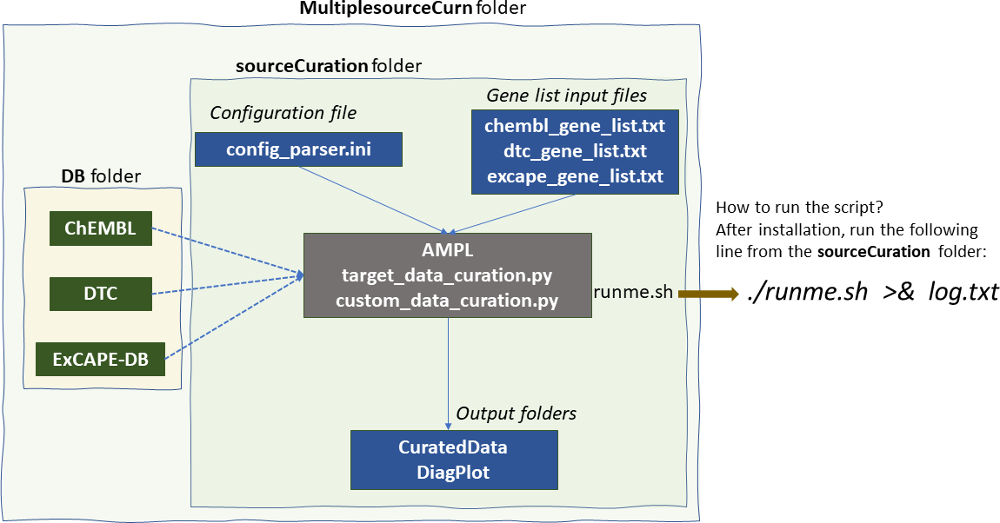

# AMPL Protein Target Bulk Data Curation Script

 

## Scope and details of the script

This AMPL package automates protein-ligand binding data download for a custom list of targets (protein) from small-molecule databases such as ChEMBL (https://www.ebi.ac.uk/chembl/), Drug Target Commons (DTC; https://drugtargetcommons.fimm.fi/), and ExCAPE-DB (https://solr.ideaconsult.net/search/excape/). The script also creates machine-learning-ready curated datasets along with some basic Exploratory Data Analysis ([EDA](https://en.wikipedia.org/wiki/Exploratory_data_analysis)) plots. 

Please note that this package has been developed using Python Object Oriented Programming concepts to provide a flexible open-source environment. We envision users bringing in small-molecule bioactive databases of their choice or use information (features) other than the ones referred to in this document. 
Users with some effort can easily -need Python programming- plug in other input database source data under `DB` folder (see below) and by extending the `custom_data_curation.py` and the configuration script, `config_parser.ini`.    

## Software/hardware requirements: 

* AMPL installation. Please check AMPL GitHub page for installation, https://github.com/ATOMScience-org/AMPL
* At least one database (ex. DTC or Excape or ChEMBL) input file placed under `DB` (see below for details) folder  
* Memory requirement tips: ~ 80 GB for three target (CASP9, KCNH2, and CYP3A4) data collected from three sources, ChEMBL, DTC and ExCAPE-DB. The run took ~ 52 minutes (see Test Run section for details) for completion.

### Software file structure 
* `DB` folder: To hold database related input files
* `sourceCuration` Folder: 
	* Python codes: `custom_data_curation.py`, `target_data_curation.py`
	* Main driver input and configuration files: `runme.sh`, `config_parser.ini`
	* Data input: `chembl_gene_list.txt`, `dtc_gene_list.txt`, `excape_gene_list.txt` 
	* Output folders: `CuratedData`, `DiagPlot` (```user creates them before running the code```)

Here is the tree structure of the `MultipleSourceCurn` directory:  
```     
MultipleSourceCurn/                            # A directory to hold all the project related files
├── [4.0K]  DB                                 # (EMPTY FOLDER, a place-holder for database files) 
└── [4.0K]  sourceCuration                     # Directory that contains the Python script, input/output files and configuration file
    ├── [4.0K]  CuratedData                    # output directory: Curated Data of all datasets 
    ├── [4.0K]  DiagPlot                       # output directory: Diagnostic Plots 
    ├── [  36]  chembl_gene_list.txt           # input gene list for ChEMBL DB extraction)
    ├── [2.4K]  config_parser.ini              # Configuration file that contains all the other DB file path 
    ├── [ 16K]  custom_data_curation.py        # Python script
    ├── [  24]  dtc_gene_list.txt              # input gene list for DTC DB extraction
    ├── [  24]  excape_gene_lst.txt            # input gene list for ExCAPE-DB extraction
    ├── [ 380]  runme.sh                       # driver file 
    └── [ 20K]  target_data_curation.py        # Python script file 
```

Due to the large DB directory size (~ 22 GB), its contents are not included in DB folder. Please create two folders, sourceCuration and DB. In this tutorial, we have these folders under `MultiplesourceCurn`.Please download the concerned files from this directory and place them under the appropriate folders. Make sure the filenames match the tags (activity_csv and/or smiles_csv and/or activity_summary) listed in the `config_parser.ini` file.
```
Contents of `DB` folder:

DB
└── ├── [2.1G]  DTC_data.csv          # Drug Data Commons (DTC) data 
    ├── [ 95M]  inchikey_smiles.csv   # DTC InChi to SMILES mapping list
    ├── [ 18G]  pubchem.chembl.dataset4publication_inchi_smiles.tsv  # ExCAPE-DB
    ├── [2.1G]  uid2cact.json         # ChEMBL DB 
    └── [557K]  uid2gn_human.json     # ChEMBL DB
```

### Instructions for running the script:
* Install AMPL. Note AMPL is a pip-based software. Please refer to this link, https://github.com/ATOMScience-org/AMPL#Install, for details.
* Create a folder to hold MultipleSourceCurn scripts. We call this folder, ```MultiplesourceCurn```.
* Within **MultiplsesourceCurn** create two sub-folders called **DB** and **sourceCuration**
* `DB` folder should hold atleast one datasource input file. Users have to download data from the data sources of their interest, such as DTC, ExCAPE-DB. Downloading the whole database files for DTC and ExCAPE-DB is straightforward. Please see the last section of this document for details. Please note that extracting the whole DB from ChEMBL needs some effort. Please check ChEMBL database links shown below for details:
      * https://chembl.gitbook.io/chembl-interface-documentation/frequently-asked-questions/chembl-download-questions
      * https://ftp.ebi.ac.uk/pub/databases/chembl/ChEMBLdb/latest/
* Once the concerned database file(s) are placed in the DB folder 
* Open a terminal and activate atomsci package using the following command, `source atomsci/bin/activate` to activate your atomsci's pip environment.
* Change directory to `MultipleSourceCurn/sourceCuration` and do the following things: 
  - Edit the configuration file, `config_parser.ini` to set the absolute path to `DB` folders. Also the configuration `end_points` section could be expanded to include `Ki,Kd,IC50,AC50,EC50`
  - Make sure to include protein targets of your choice in the files `*_gene_list.txt`. Please note that different databases adopt different alias names/IDs for referring to genes. For this reason, we have separate DB-specific input files.   
    * ChEMBL gene list should follow the naming convention as shown in `chembl_gene_list.txt`
    * DTC gene list should follow the naming convention as shown in `dtc_gene_list.txt` 
    * ExCAPE-DB gene list should follow the naming convention as shown `excape_gene_list.txt`
* After completing the above-mentioned steps, run the following script
  - `./runme.sh >& log.out` 
  

## DB directory details: 

* **CuratedData** (*User creates them under sourceCuration subfolder*) : Directory location where the combined/curated machine-learning model-ready datasets and rejected compounds will be stored
* **DiagPlot** (*User creates them under sourceCuration subfolder*)  : Location for diagnostic data plots (pdf format)
    * currently will contain just distribution of activity values for final set

## Test run: 
Python code was tested for single and multiple protein targets along with different choices 
for the accumulation assay data type (ki, IC50 etc.)  

Here are some details on computational time for a test set of 3 protein targets, CASP9, KCNH2 and CYP3A4 with 
three end_points (ChEMBL definition;  ) IC50, Ki and EC50 and three data sources, DTC, ExcapeDB and ChEMBL. 

System tested: Google Cloud Platform (GCP; https://en.wikipedia.org/wiki/Google_Cloud_Platform), Intel Haswell CPU with 4vCPUs and 100GB memory. 
Peak memory usuage was ~80 GB. Here is the time to extract and curate data.

```
real    51m49.211s
user    50m9.502s
sys     0m59.148s
```

## Guidelines on how to extract data (the contents of the `DB` database folder) from the database sources

### ExCAPE-DB

Visit the Excape site, https://zenodo.org/record/2543724#.YMtnGahKguU,
to download the latest dataset. The dataset file will be a xz format compressed file. 
To uncompress, use the following command: 
(At the time of download, v2 was available; please check the downloaded file and replace the 
filename accordingly)
xz -d pubchem.chembl.dataset4publication_inchi_smiles_v2.tsv.xz 

Warning: the uncompressed file could take up to ~20 GB. 

Here is how you can extract a single target (ex. HTR3A) related data using the following Linux shell command,
```
awk -F'\t' '$9 == "HTR3A"'  pubchem.chembl.dataset4publication_inchi_smiles.tsv > temp
```
Here are the first few lines of the dataset:
```
Ambit_InchiKey  Original_Entry_ID       Entrez_ID       Activity_Flag   pXC50   DB      Original_Assay_ID       Tax_ID  Gene_Symbol     Ortholo
g_Group InChI   SMILES
AAAAZQPHATYWOK-YRBRRWAQNA-N     11399331        2064    A       7.19382 pubchem 248914  9606    ERBB2   1346    InChI=1/C32H29ClN6O3S/c1-4-41-2
8-16-25-22(15-26(28)37-30(40)10-7-13-39(2)3)32(20(17-34)18-35-25)36-21-11-12-27(23(33)14-21)42-19-31-38-24-8-5-6-9-29(24)43-31/h5-12,14-16,18H,
4,13,19H2,1-3H3,(H,35,36)(H,37,40)/b10-7+/f/h36-37H     ClC=1C=C(NC=2C=3C(N=CC2C#N)=CC(OCC)=C(NC(=O)/C=C/CN(C)C)C3)C=CC1OCC=4SC=5C(N4)=CC=CC5
AAAAZQPHATYWOK-YRBRRWAQNA-N     CHEMBL175513    1956    A       6.73    chembl20        312997  9606    EGFR    1260    InChI=1/C32H29ClN6O3S/c
1-4-41-28-16-25-22(15-26(28)37-30(40)10-7-13-39(2)3)32(20(17-34)18-35-25)36-21-11-12-27(23(33)14-21)42-19-31-38-24-8-5-6-9-29(24)43-31/h5-12,14
-16,18H,4,13,19H2,1-3H3,(H,35,36)(H,37,40)/b10-7+/f/h36-37H     C1=2C(=C(C#N)C=NC1=CC(=C(C2)NC(/C=C/CN(C)C)=O)OCC)NC3=CC(Cl)=C(C=C3)OCC4=NC=5C=
CC=CC5S4
```

### DTC

Visit http://drgutargetcommons.fimm.fi/ and download the whole dataset. Here are the first few lines of the dataset:

```
(atomsci) jupyter@ampl-ravi:~/MultipleSourceCurn/DB$ head DTC_data.csv

compound_id,standard_inchi_key,compound_name,synonym,target_id,target_pref_name,gene_names,wildtype_or_mutant,mutation_info,pubmed_id,standard_type,standard_relation,standard_value,standard_units,activity_comment,ep_action_mode,assay_format,assaytype,assay_subtype,inhibitor_type,detection_tech,assay_cell_line,compound_concentration_value,compound_concentration_value_unit,substrate_type,substrate_relation,substrate_value,substrate_units,assay_description,title,journal,doc_type,annotation_comments
CHEMBL3545284,"",CERDULATINIB,,Q9Y4K4,MITOGEN-ACTIVATED PROTEIN KINASE KINASE KINASE KINASE 5,MAP4K5,,,29191878,KDAPP,=,19155.14,NM,,inhibition,cell_free,binding,binding_reversible,"",label_free_technology,"K-562, COLO 205, MV-4-11, SK-N-BE(2)",3-30,NM-UM,,,,,LC-MS/MS BASED KINOBEADS COMPETITIVE PULL-DOWN ASSAY,THE TARGET LANDSCAPE OF CLINICAL KINASE DRUGS,SCIENCE,,
CHEMBL3545284,"",CERDULATINIB,,Q9Y478,"AMP-ACTIVATED PROTEIN KINASE, BETA-1 SUBUNIT",PRKAB1,,,29191878,KDAPP,=,1565.72,NM,,inhibition,cell_free,binding,binding_reversible,"",label_free_technology,"K-562, COLO 205, MV-4-11, SK-N-BE(2)",3-30,NM-UM,,,,,LC-MS/MS BASED KINOBEADS COMPETITIVE PULL-DOWN ASSAY,THE TARGET LANDSCAPE OF CLINICAL KINASE DRUGS,SCIENCE,,

```

### ChEMBL 

* Visit, https://ftp.ebi.ac.uk/pub/databases/chembl/ChEMBLdb/latest/ and download the MySQL data and convert the database 
into the input JSON file 

The two JSON files contain information about binding data for different ChEMBL assays and UniProt entry name to gene name mapping.

`uid2gn_human.json`: This file can be downloaded from UniProt web browser. Here are the first few lines of the file. 
```
	uniprot_entry_name	gene_names
0	1433B_HUMAN	         YWHAB
1	1433E_HUMAN	         YWHAE
2	1433F_HUMAN	         YWHAH
3	1433G_HUMAN	         YWHAG
4	1433S_HUMAN	         SFN
```

`uid2catn.json` 

```
	chemicals	                     smiles	                             pChEMBL	activity	relation	unit	    assay_id	type
0	None_CHEMBL117286	Oc1ccc(-c2cc(-c3ccc(O)cc3)cc(-c3ccc(O)cc3)c2)cc1	7.10	80.0	            =	         nM	  CHEMBL658311	  EC50
1	None_CHEMBL66511	COc1ccc(-c2cccc(-c3ccc(OC)cc3)c2)cc1	                 NaN	10000.0	            >	         nM	  CHEMBL658311	  EC50
2	None_CHEMBL66279	Oc1ccc(-c2cccc(-c3ccc(O)cc3)c2)cc1	                6.10	800.0	            =	         nM	  CHEMBL658311	  EC50
3	None_CHEMBL116918	Oc1ccc(-c2ccc(-c3ccc(O)cc3)cc2)cc1	                5.92	1200.0	            =	         nM	  CHEMBL658311	  EC50
4	None_CHEMBL113704	CC1C(=O)c2cc(O)ccc2OC1c1ccc(O)cc1	                8.40	4.0	            =	         nM	  CHEMBL658311	  EC50
```

If you have any questions or comments, please raise them via AMPL Issues link, https://github.com/ATOMScience-org/AMPL/issues

