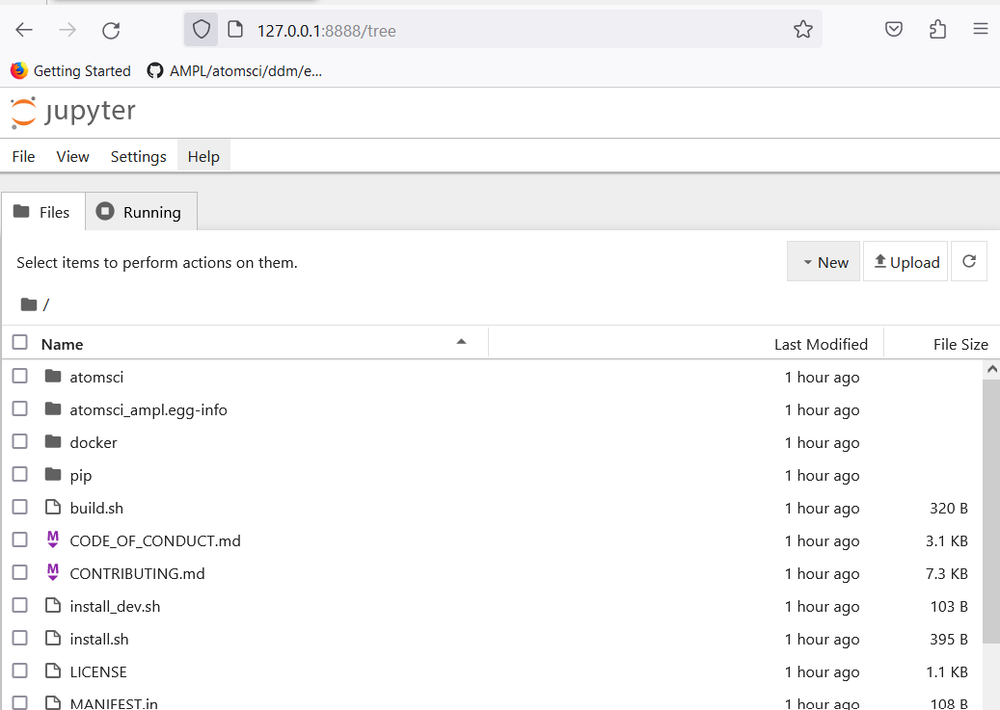

# Install AMPL From Docker

This page provides an option to use Docker to install **[AMPL](https://github.com/ATOMScience-org/AMPL)**. For an alternate way, please see "AMPL Readthedocs Getting Started" **[Install](https://ampl.readthedocs.io/en/latest/getting_started/install.html)** page.

To install **[AMPL](https://github.com/ATOMScience-org/AMPL)** software using Docker, the major steps are:

* [Create or Pull a Docker Image](#create-or-pull-a-docker-image)
* [Run a Docker Container](#run-a-docker-container)
* [Start the Notebook Server From a Container](#start-the-notebook-server-from-a-container)

# System Requirements
The Docker image will run on Linux / WSL / macOS (Intel only).

If you don't have Docker Desktop installed, please follow instructions [here]( https://www.docker.com/get-started).

Once it's installed, click on the Docker icon to start. Leave it running when using Docker.

# Create or Pull a Docker Image

You can either pull a prebuilt **[AMPL](https://github.com/ATOMScience-org/AMPL)** image (option 1) or build one yourself (option 2).

## Option 1: Pull a Prebuilt AMPL Image from Docker Repo

The simplest method is to download a prebuilt Docker image from DockerHub. For every official AMPL release, a docker image will be pushed to its [Docker Hub](https://hub.docker.com/r/atomsci/atomsci-ampl). 

To pull a prebuilt **[AMPL](https://github.com/ATOMScience-org/AMPL)** image:

```
docker pull atomsci/atomsci-ampl:latest
```

After that, please follow the instruction from [Run a Docker Container](#run-a-docker-container) step.

## Option 2: Build an Image Using **Dockerfile**

There may be a few reasons why you want to build your own **[AMPL](https://github.com/ATOMScience-org/AMPL)** Image using a Dockerfile.  These can include:

  * You want to customize the install options for your environment,
  * You want to test a development version/branch to try new features or bugfixes

First clone **[AMPL](https://github.com/ATOMScience-org/AMPL)**  github repo, then find the Dockerfile:

```
git clone https://github.com/ATOMScience-org/AMPL.git  
### The following line is _optional_. If you want to check out a development branch instead of the default branch (master).
git checkout 1.6.1                    # (optional) checkout a dev branch, 1.6.1 for example
cd AMPL/docker                        # To get to the Dockerfile
```

Build an image using the Dockerfile:

```
# example 1
docker build -t atomsci-ampl .       # by default, "latest" will be the tag
# - or - 
# example 2
docker build -t atomsci-ampl:<tag> . # specify a name for <tag>
```

This normally takes about 15-20 minutes to build. Once it's built on your machine, it can be reused.

> **Note:** *To build without cache, add "--no-cache" flag after "docker build". For example, "docker build --no-cache -t atomsci-ampl ."*

# Run a Docker Container

To see what images are running on your machine, type "docker images". 


Use "docker run ... <IMAGE>" command to start the container. The command syntax is:

```
docker run -it -p <port>:<port> -v <local_folder>:<directory_in_docker> <IMAGE>
```

Use either following example to start the container:

```
# example 1 # if built locally
docker run -it -p 8888:8888 -v ${PWD}:/home atomsci-ampl
# - or -
# example 2 # if pulled from atomsci's docker hub
docker run -it -p 8888:8888 -v ${PWD}:/home atomsci/atomsci-ampl
```

To get more info for the "docker run" command options, type "docker run --help": 
 
```
  -i, --interactive                    Keep STDIN open even if not attached
  -t, --tty                            Create a pseudo terminal
  -p, --publish port(s) list           Publish a container's port(s) to the host
  -v, --volume list                    Bind mount a volume </pre>
```

## Start the Notebook Server From a Container

To launch the server, you can choose to run using "jupyter-notebook" or "jupyter-lab" using the same port when starting the container. We use "jupyter-notebook" command as examples here:

```
jupyter-notebook --ip=0.0.0.0 --allow-root --port=8888 &
```
This will output a message with similar URLs to this:


### To Connect to the Jupyter Notebook UI From a Browser

Copy and paste the URL from the output message (highlighted in yellow from above) to the browser on your computer. Like this one:


> **NOTE:**
> *If this doesn't work, exit the container and choose a different port
> such as "7777" or "8899" (in all 3 places it's 
> written), then rerun both commands in 
> [Start a Docker container](#start-a-container-from-the-ampl-image) and 
> [Start the Jupyter notebook from a container](#start-the-Jupyter-notebook-from-a-container). 
> Be sure to save any work in your container. This is because if the container 
> is shut down, you'll lose anything not in that folder. See instructions on [Save work from Docker Jupyter](#save-work-from-docker-jupyter).*  

Once connected, you will see a screen like this:



### Code Examples

The **[AMPL](https://github.com/ATOMScience-org/AMPL)** code is in:

```
http://127.0.0.1:<port_number>/tree/AMPL/atomsci/ddm/
```

The tutorials examples are in:
```
http://127.0.0.1:<port_number>/tree/AMPL/atomsci/ddm/examples/tutorials
```

> **Note:** *"<port_number>" is the number that you used when starting "docker run -p ...".*

Here's a screenshot of the AMPL tutorials directory:


### Use **atomsci-env** as the Run Kernel

In order to use **[AMPL](https://github.com/ATOMScience-org/AMPL)** Framework, select "atomsci-env" as the run kernel for the notebook. This should be set during image creation. In case it's not set, or if you want to verify. Try one of the following:

* From an existing notebook, top menu bar "Kernel" > "Change Kernel" > "atomsci-env"


* From a new notebook, click "File" > "New" > "Notebook" menu, and select **atomsci-env** as the run kernel


### Save Work From Docker

A Docker container is stateless. Once you exit, the work will not persist. There are a couple of ways to save your files:

1) From the browser Jupyter Notebook page menu, "File" -> "Download" to download the file(s).

2) Use mount. When you start the Docker with "-v" option:

```
docker run -it -p <port>:<port> -v <local_folder>:<directory_in_docker> <IMAGE>
```

It binds the <local_folder> with <directory_in_docker>, meaning that the file(s) in <directory_in_docker>, will be available in <local_folder>.

For example:

* Run the docker with "-v" to bind the directories

```
docker run -it -p 8888:8888 -v ~:/home atomsci-ampl # <local_folder> -> "~", <directory_in_docker> -> "/home".
```

* Save, copy the file(s) to <directory_in_docker>

```
root@d8ae116b2a83:/AMPL# pwd
/AMPL
root@d8ae116b2a83:/AMPL# cp atomsci/ddm/examples/01_install_with_docker.md /home
```

* The file(s) will be in <local_folder>

---

### Useful Docker Commands

```
docker run --help                              # get help messages
docker ps -a                                   # check docker processes
docker images                                  # list local docker images
docker rmi <image>                             # remove an image
docker cp file.txt <container_id>:/file.txt    # copy from local to container
docker cp <container_id>:source_path dest_path # copy from container to local
```

### Troubleshooting

* Problem with token

If you try to connect the Jupyter Notebook URL, but got a prompt for password or token, go to the docker terminal, type in

```
jupyter server list
```


And copy the string after "token=" and  paste that, then click "Log in"


