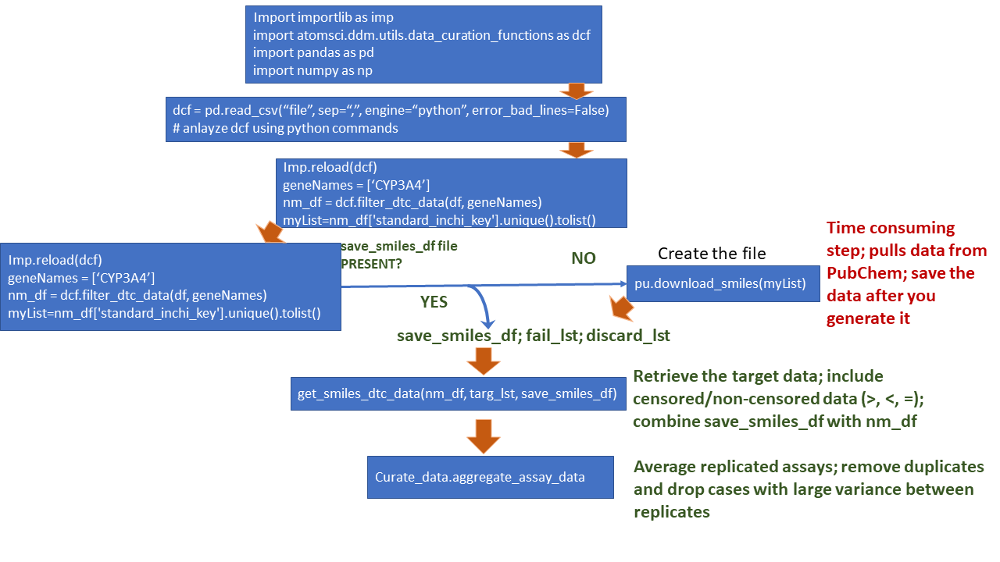

### Single target focussed data
* ChEMBL & Escape-DB: It is easy to download from the DB websites
* Drug Target Commons (DTC): Please see below <br>
   * Some of the DTC target related information (ex Target: CYP3A4) will be big (> 46K compounds and ~ 16 MB) and downloading large datasets will take a long time.
     If that happens, the best option would be to download the whole DTC dataset (~ 2 GB) and extract the target of your interest from the master file. Here are the steps:

         * Visit DTC site, https://drugtargetcommons.fimm.fi/ 
         * Download the whole dataset (I am assuming that you are using a Linux or Mac OS for this exercise)
         * Extract the target of your interest (e.g., CYP3A4) using the following Linux shell commands:

            ```
            wget https://drugtargetcommons.fimm.fi/static/Excell_files/DTC_data.csv -o DTC_data.csv 
            grep CYP3A4 DTC_data.csv > raw_data.txt 
            head -1 DTC_data.csv > header 
            cat header raw_data.txt > DTC_CYP3A4.csv 
            ```
            
If your data came from one datasource or you have a custom data, then you can skip the merging step. In other cases, you might want to download data from multiple sources and merge them to create a combined dataset. The procedure can be described as follows: After you download the datasets from multiple database sources, you need to ingest, merge and featurize the dataset. The following section, `Data ingestion, merging, curation and featurization`, will provide sample Jupyter notebooks that will address these steps.         

### Data ingestion, merging, curation and featurization

Here are the key steps of AMPL data curation (reading binding data (ex. DTC), extracting SMILES from PubChem, creating standardized SMILES, merging multiple assay values after dealing with high variant values; for details, look at the tutorial notebooks from this section):



 
