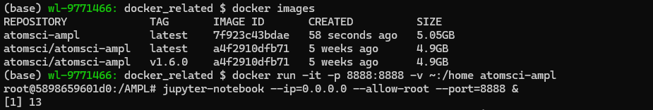
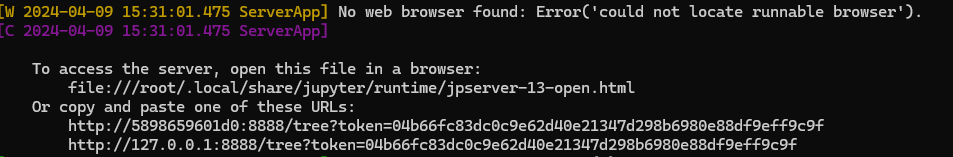
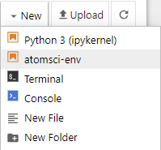
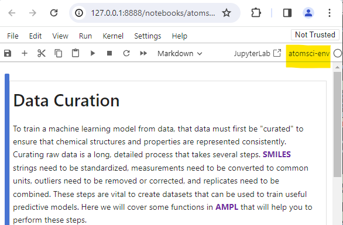
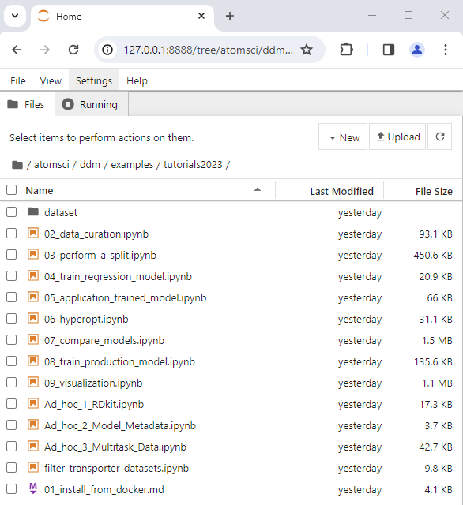
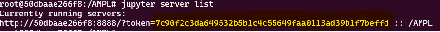
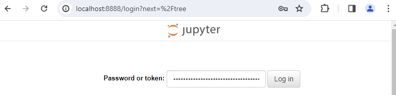

# Install AMPL From Docker

The purpose of this tutorial is to install the **[AMPL](https://github.com/ATOMScience-org/AMPL)** software from Docker, which will provide accessibility across multiple platforms. Here are the topics to be covered in this tutorial:

* [Prerequisite: Download and install Docker](#prerequisite-download-and-install-docker) 
* [Option 1: Build a local AMPL image using `Dockerfile`](#option-1-build-a-local-ampl-image-using-dockerfile)
   * [To build a Docker image](#to-build-a-docker-image)
* [Option 2: Pull an existing AMPL image from the Docker repo](#option-2-pull-an-existing-ampl-image-from-docker-repo)
* [Start a container from the AMPL image](#start-a-container-from-the-AMPL-image)
   * [Use an existing image to start a container](#use-an-existing-image-to-start-a-container)
* [Start the Jupyter notebook from a container](#start-the-jupyter-notebook-from-a-container)
   * [To connect the Jupyter notebook from a browser](#to-connect-the-jupyter-notebook-from-a-browser)
   * [Use `atomsci-env` as the run kernel for AMPL](#use-atomsci-env-as-the-run-kernel-for-AMPL)
* [Code examples](#code-examples)
* [Useful Docker commands](#useful-docker-commands)
* [Trouble Shooting](#trouble-shooting)

> **Note:** 
> ***If you already have an AMPL image previously built from either option 1 or 2, go to this [step](#use-an-existing-image-to-start-a-container) to start/run a container.***

## Prerequisite: Download and install Docker

If you don't have a Docker Desktop installed, please follow instructions here: https://www.docker.com/get-started.

Click on the Docker icon to start the Docker. Leave it running when using Docker.

## Option 1: Build a local AMPL image using `Dockerfile`

- Clone **[AMPL](https://github.com/ATOMScience-org/AMPL)**  github repo if you don't have one yet. 
- *(Optional)* if you plan to use code from a different branch other than the default (master), see line 2 for example.

```
git clone https://github.com/ATOMScience-org/AMPL.git  
git checkout 1.6.1                                     # checkout 1.6.1 for example
cd <your AMPL directory>
```

- The AMPL [Dockerfile](../../../../docker/Dockerfile) is in `AMPL/docker` directory.

### To build a Docker image

```
# example 1
docker build -t atomsci-ampl .       # by default, `latest` will be used as the tag

# or
# example 2
docker build -t atomsci-ampl:<tag> . # specify a name for <tag>
```

This normally takes about 15 minutes to build. The image can be **reused**. 

Once it's built, follow the [steps](#start-a-container-from-the-ampl-image) to start and run the AMPL docker image.

## Option 2: Pull an existing AMPL image from Docker repo

```
docker pull atomsci/atomsci-ampl:latest
```

## Start a container from the AMPL image

### Use an existing image to start a container

If you have an image built/downloaded, type `docker images` to see what images are currently available. Pick one to use. For example:



The `docker run` command syntax:

```
docker run -it -p 8888:8888 -v </local_workspace_folder>:</directory_in_docker> atomsci/atomsci-ampl
```

```
# example 1 # if built from Dockerfile
docker run -it -p 8888:8888 -v ~:/home atomsci-ampl

# or
# example 2 # if pulled from atomsci
docker run -it -p 8888:8888 -v ~:/home atomsci/atomsci-ampl
```

> #### To get more info for the `docker run` command options, type `docker run --help`. For example: 
> 
>  <pre> -i, --interactive                    Keep STDIN open even if not attached
>  -t, --tty                            Create a pseudo terminal
>  -p, --publish port(s) list           Publish a container's port(s) to the host
>  -v, --volume list                    Bind mount a volume </pre>

## Start the Jupyter notebook from a container

```
#inside docker container
jupyter-notebook --ip=0.0.0.0 --allow-root --port=8888 &
# -OR-
jupyter-lab --ip=0.0.0.0 --allow-root --port=8888 &
```
As a result, this will output a message with similar URLs to this:




### To connect the Jupyter notebook from a browser

Copy and paste the URL from your output message to the browser on your computer. For example:


> **NOTE:**
> *If this doesn't work, exit the container and change port from 
> 8888 to some other number such as `7777` or `8899` (in all 3 places it's 
> written), then rerun both commands in 
> [Start a container](#start-a-container-from-the-ampl-image) and 
> [Start Jupyter Notebook](#start-the-Jupyter-notebook-from-a-container). 
> Be sure to save any work you want to be permanent in your workspace folder. 
> If the container is shut down, you'll lose anything not in that folder.*  

### Use `atomsci-env` as the run kernel for AMPL

There are two ways to set a kernel:

* From a notebook, top menu bar `Kernel` > `Change Kernel` > `atomsci-env`


* Outside of a notebook, click `New` dropdown from upper right corner, 
and select `atomsci-env` as the run kernel




* The notebook would look like this:



## Code examples:

The AMPL code is in:

```
http://127.0.0.1:<port_number>/tree/AMPL/atomsci/ddm/
```

> **Note:** *`<port_number>` is the number that you used when starting `docker run -p ...`.*

The tutorials examples are in:

```
http://127.0.0.1:<port_number>/tree/AMPL/atomsci/ddm/examples/tutorials2023
```



Also, there are examples in 
[AMPL's Read the Docs](https://ampl.readthedocs.io/en/latest/) on how to use AMPL Framework.

---

## Useful Docker commands

```
docker run --help                           # get help messages
docker ps -a                                # check docker processes
docker images                               # list local docker images
docker rmi <image>                          # remove an image
docker cp file.txt <container_id>:/file.txt # copy from local to container
docker cp <container_id>:/file.txt file.txt # copy from container to local
```

## Trouble Shooting

* Problem with token

If you try to connect the Jupyter Notebook URL but got a prompt for password or token. From the docker terminal, type in

```
jupyter server list
```



And copy the string after `token=` and  paste the token to log in


