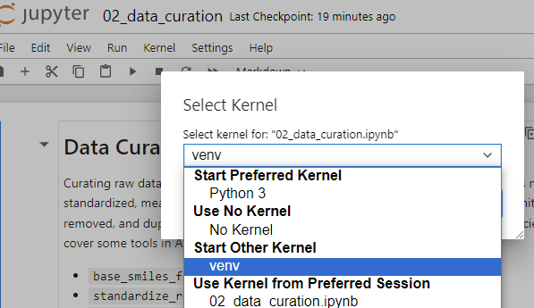
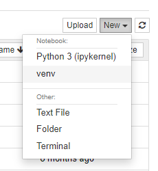

# Install AMPL From Docker

The purpose of this tutorial is to install the [AMPL](https://github.com/ATOMScience-org/AMPL)software from Docker, which will
provide accessibility across multiple platforms. There are two ways to set up [AMPL](https://github.com/ATOMScience-org/AMPL): 

1. [Pull an existing AMPL image from the Docker repo](#2-pull-an-existing-ampl-image-from-docker-repo)
2. [Build a local image using Dockerfile.](#create-a-local-image-using-dockerfile)

The following instructions are to run the container using Docker from the command line, 
but Docker Desktop can also be used with similar commands.

## 1. Download and install Docker.

Follow directions found here: https://www.docker.com/get-started.


## 2. Pull an existing AMPL image from Docker repo

```
docker pull atomsci/atomsci-ampl:latest
```

## 3. Start a container from the AMPL image using the interactive flag

```
docker run -it -p 8888:8888 -v </local_workspace_folder>:</directory_in_docker> atomsci/atomsci-ampl
```
For example
```
docker run -it -p 8888:8888 -v ~:/home atomsci/atomsci-ampl
```

## 4. From the command line inside the container, start the jupyter notebook

```
   jupyter-notebook --ip=0.0.0.0 --allow-root --port=8888 &
```

As a result, this will output a message with similar URLs to this:

```
    To access the server, open this file in a browser:
        file:///root/.local/share/jupyter/runtime/jpserver-14-open.html
    Or copy and paste one of these URLs:
        http://43aadd0c29db:8888/tree?token=b38528f4614743bdcac6e02c07cffabddd285007769d7d58
        http://127.0.0.1:8888/tree?token=b38528f4614743bdcac6e02c07cffabddd285007769d7d58
```

## 5. Open a browser to paste in the URL

Copy and paste either url into your browser. For example:

```
http://127.0.0.1:8888/tree?token=b38528f4614743bdcac6e02c07cffabddd285007769d7d58
```

> **_NOTE:_** If this doesn't work, exit the container and change port from 
8888 to some other number such as `7777` or `8899` (in all 3 places it's 
written), then rerun both commands in 
[step 3](#3-run-the-ampl-image-interactively) and 
[step 4](#4-when-inside-the-container-start-the-jupyter-notebook). 
Be sure to save any work you want to be permanent in your workspace folder. 
If the container is shut down, you'll lose anything not in that folder.  

The AMPL code is in:

```
http://127.0.0.1:<port_number>/tree/AMPL/atomsci/ddm/
```

## 6. Code examples:

The tutorials examples are in:

```
http://127.0.0.1:<port_number>/tree/AMPL/atomsci/ddm/examples/tutorials2023
```

Also, there are examples in 
[AMPL's Read the Docs](https://ampl.readthedocs.io/en/latest/) on how to use AMPL Framework.

---

## 7. To use AMPL select `venv` as the run environment

There are two ways to set an environment:

* From a notebook, top menu bar `Kernel` > `Change Kernel` > `venv`



* Outside of a notebook, click `New` dropdown from upper right corner, 
and select `venv` as the run environment




## Alternative: create a local image using `Dockerfile`

AMPL [Dockerfile](../../../../docker/Dockerfile) is in `AMPL/docker` directory.
To build a Docker image:

```
docker build -t atomsci-ampl:<tag> .
```

Once it's built, follow the steps starting [`step 3`](#3-run-the-ampl-image-interactively) to start and run the local copy of AMPL docker image.

## Useful Docker commands

```
docker ps -a                                # check docker processes
docker cp file.txt <container_id>:/file.txt # copy from local to container
docker cp <container_id>:/file.txt file.txt # copy from container to local
```
